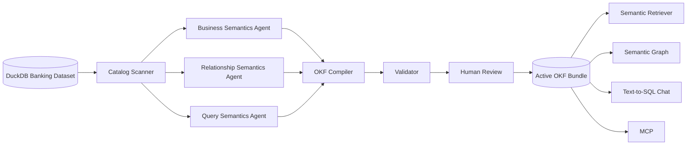
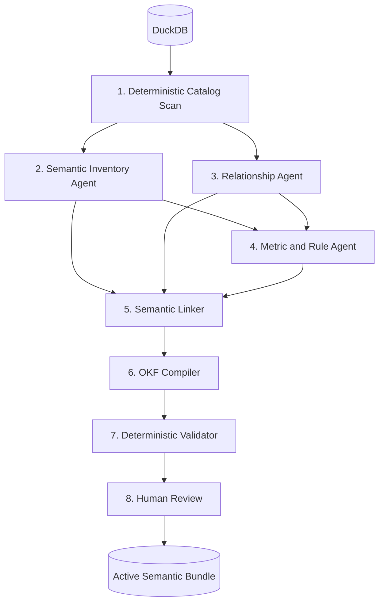
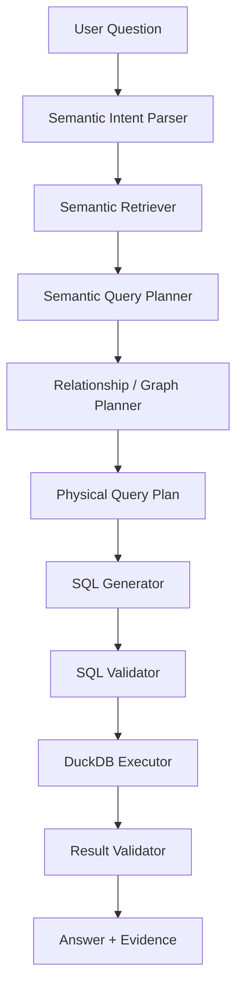
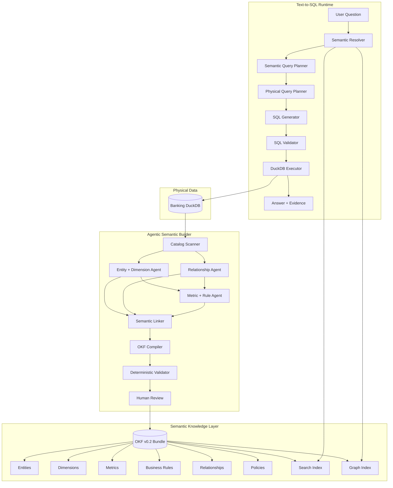

# Cerebro Semantic Layer + OKF Upgrade Plan

## 1. Objective

Upgrade the current Cerebro hackathon POC from:

> **OKF knowledge graph + schema grounding + Text-to-SQL**

into:

> **A governed Semantic Layer represented using OKF, generated by bounded agents, validated deterministically, and consumed by a semantic-first Text-to-SQL runtime.**

The goal is **not** to rebuild Cerebro.

The current platform already provides most of the required infrastructure:

- DuckDB source discovery
- OKF generation
- business-semantic generation
- relationship generation
- query-semantic generation
- candidate compilation
- deterministic validation
- review and activation
- semantic retrieval
- graph visualization
- MCP interface
- governed Text-to-SQL chat

The next iteration should strengthen the **semantic model and contracts**.

---

# 2. Current Cerebro Architecture

The current repository already approximately implements:



This is already conceptually correct.

The issue is mostly **what the semantic stages produce**.

---

# 3. Main Weakness of the Current Semantic Model

The current bundle contains:

```text
datasets/
tables/
concepts/
relationships/
metrics/
policies/
```

The problem is that `concepts/` currently contains semantically different things.

Examples include:

```text
account-balance
active-customer
bad-debt
branch-performance
card-fraud
customer-demographics
repayment-behavior
support-workload
transaction-activity
```

These are not all the same type of semantic object.

For example:

```text
Customer
```

is an **entity**.

```text
Customer Gender
```

is a **dimension**.

```text
Active Customer
```

is a **business rule**.

```text
Account Balance
```

is a **metric / measure**.

```text
Transaction Activity
```

is an **event/business concept**.

Treating all of them simply as `concept` weakens downstream reasoning.

The semantic layer should make these distinctions explicit.

---

# 4. Target Semantic Model

Cerebro should introduce the following first-class semantic objects.

```text
SEMANTIC LAYER

Entity
Dimension
Metric
Business Rule
Relationship
Policy

            ↓ maps to

PHYSICAL LAYER

Dataset
Table
Column
Key
```

For the current banking dataset:

```text
ENTITY
├── Customer
├── Account
├── Transaction
├── Card
├── Card Transaction
├── Loan
├── Loan Payment
├── Branch
├── Employee
└── Support Ticket
```

Dimensions could include:

```text
DIMENSION
├── Customer Gender
├── Customer Age
├── Branch
├── Transaction Type
├── Transaction Channel
├── Merchant Category
├── Card Type
├── Loan Type
├── Loan Status
├── Transaction Date
└── Customer Risk / Credit attributes
```

Metrics could include:

```text
METRIC
├── Transaction Volume
├── Account Balance
├── Customer Count
├── Card Fraud Rate
├── Late Payment Rate
└── Non-performing Loan Rate
```

Business rules could include:

```text
BUSINESS RULE
├── Active Customer
├── Fraudulent Card Transaction
├── Late Loan Payment
├── Non-performing Loan
├── Transaction Direction
└── Relative Time Anchor
```

Relationships remain:

```text
RELATIONSHIP
├── Customer → Account
├── Account → Transaction
├── Customer → Card
├── Card → Card Transaction
├── Customer → Loan
├── Loan → Loan Payment
├── Account → Branch
└── Employee → Branch
```

---

# 5. Recommended OKF Structure

Evolve:

```text
knowledge/bank-workshop/
├── datasets/
├── tables/
├── concepts/
├── relationships/
├── metrics/
└── policies/
```

toward:

```text
knowledge/bank-workshop/
│
├── index.md
├── bundle.yaml
│
├── datasets/
│   ├── index.md
│   └── banking-dataset.md
│
├── tables/
│   ├── index.md
│   ├── customers.md
│   ├── accounts.md
│   ├── transactions.md
│   ├── cards.md
│   ├── card-transactions.md
│   ├── loans.md
│   ├── loan-payments.md
│   ├── branches.md
│   ├── employees.md
│   └── support-tickets.md
│
├── entities/
│   ├── index.md
│   ├── customer.md
│   ├── account.md
│   ├── transaction.md
│   ├── card.md
│   ├── loan.md
│   └── branch.md
│
├── dimensions/
│   ├── index.md
│   ├── customer-gender.md
│   ├── customer-age.md
│   ├── transaction-type.md
│   ├── transaction-channel.md
│   ├── merchant-category.md
│   ├── branch.md
│   └── time.md
│
├── metrics/
│   ├── index.md
│   ├── account-balance.md
│   ├── transaction-volume.md
│   ├── customer-count.md
│   ├── card-fraud-rate.md
│   ├── late-payment-rate.md
│   └── non-performing-loan-rate.md
│
├── rules/
│   ├── index.md
│   ├── active-customer.md
│   ├── transaction-direction.md
│   ├── fraudulent-card-transaction.md
│   ├── late-payment.md
│   ├── non-performing-loan.md
│   └── relative-time-anchor.md
│
├── relationships/
│   ├── index.md
│   ├── account-customer.md
│   ├── transaction-account.md
│   ├── card-customer.md
│   ├── card-account.md
│   ├── card-transaction-card.md
│   ├── loan-customer.md
│   ├── loan-payment-loan.md
│   ├── account-branch.md
│   └── employee-branch.md
│
└── policies/
    ├── index.md
    └── sensitive-banking-data.md
```

For the hackathon, do **not** introduce more folders unless they have an actual semantic purpose.

---

# 6. Introduce the Cerebro Semantic Profile

OKF should remain the portable outer format.

Cerebro should define a stricter schema inside it.

Architecture:

```text
                    OKF v0.2
                       │
                       ▼
             Cerebro Semantic Profile
                       │
         ┌─────────────┼─────────────┐
         ▼             ▼             ▼
       Entity       Dimension      Metric
         │             │             │
         └──── Relationship ─────────┘
                       │
                 Business Rule
                       │
                     Policy
```

OKF remains responsible for:

```text
Markdown
YAML frontmatter
sources
generated
verified
status
stale_after
cross-links
portability
```

Cerebro is responsible for:

```text
grain
entity mappings
dimensions
metric definitions
aggregation
filters
time semantics
join contracts
cardinality
business rules
physical bindings
query restrictions
```

---

# 7. First Fix OKF v0.2 Conformance

Before adding more semantic features, clean up the existing bundle.

## 7.1 Root `index.md`

The current root contains approximately:

```yaml
---
type: index
name: Bank workshop semantic layer
---
```

Change it to:

```yaml
---
okf_version: "0.2"
---
```

Then use Markdown for its contents:

```markdown
# Banking Semantic Layer

Knowledge model for the banking transaction demonstration dataset.

## Physical Data

- [Dataset](datasets/)
- [Tables](tables/)

## Semantic Model

- [Entities](entities/)
- [Dimensions](dimensions/)
- [Metrics](metrics/)
- [Business Rules](rules/)
- [Relationships](relationships/)

## Governance

- [Policies](policies/)
```

---

## 7.2 Lifecycle status

Current Cerebro objects use:

```text
active
draft
deprecated
```

Normalize source OKF to:

```text
draft
stable
deprecated
```

For backward compatibility:

```text
active → stable
```

during bundle loading.

---

## 7.3 Provenance

Current documents contain custom structures such as:

```yaml
provenance:
  origin: human_reviewed
  source: config/bank-source.yaml
```

Move source-level trust toward OKF v0.2:

```yaml
sources:
  - id: source-config
    resource: config/bank-source.yaml
    title: Banking source declarations

generated:
  by: cerebro/semantic-builder
  at: 2026-09-07T12:00:00Z

verified:
  - by: human:data-owner
    at: 2026-09-07T13:00:00Z

status: stable
```

Internal generation details can still live under:

```yaml
cerebro:
```

---

# 8. Make Physical Tables Purely Physical

A table document should describe **what physically exists**.

Example:

```yaml
---
type: Table
title: Transactions
description: Account-level banking transactions.
resource: duckdb://bank/main/transactions
status: stable

cerebro:
  kind: physical_table

  physical:
    schema: main
    table: transactions

  grain:
    type: event
    description: One row per account transaction
    key:
      - transaction_id

  primary_key:
    - transaction_id

  columns:
    - name: transaction_id
      data_type: BIGINT

    - name: account_id
      data_type: BIGINT

    - name: txn_date
      data_type: DATE

    - name: txn_type
      data_type: VARCHAR

    - name: amount
      data_type: DOUBLE

    - name: channel
      data_type: VARCHAR
---
```

Avoid putting too much business interpretation directly in table documents.

Physical facts should mostly come from deterministic discovery.

---

# 9. Introduce Entity Objects

Example:

`entities/customer.md`

```yaml
---
type: Entity
title: Customer
description: A banking customer represented by one customer record.
status: stable
tags:
  - banking
  - customer

cerebro:
  kind: entity

  physical_mapping:
    primary:
      table: /tables/customers.md
      key:
        - customer_id

  aliases:
    - customer
    - client
    - account holder

  grain:
    type: entity
    description: One banking customer
---
```

Markdown body:

```markdown
# Customer

A customer represents one banking customer.

Customers may own multiple
[Accounts](/entities/account.md), hold multiple
[Cards](/entities/card.md), and receive multiple
[Loans](/entities/loan.md).
```

This gives the agent the business object **Customer** rather than forcing it to reason directly from `customers`.

---

# 10. Introduce Dimension Objects

Dimensions should become first-class instead of remaining loosely typed dictionaries inside `QuerySemantics`.

Example:

`dimensions/transaction-channel.md`

```yaml
---
type: Dimension
title: Transaction Channel
description: Channel through which an account transaction occurred.
status: stable

cerebro:
  kind: dimension

  entity: /entities/transaction.md

  physical_mapping:
    table: /tables/transactions.md
    column: channel

  data_type: categorical

  allowed_for:
    metrics:
      - /metrics/transaction-volume.md
---
```

Other useful dimensions:

```text
Customer Gender
Customer Age
Branch
Transaction Type
Transaction Channel
Merchant Category
Loan Status
Loan Type
Time
```

---

# 11. Strengthen Metric Contracts

The current model has:

```python
formula: str
filters: list[str]
grain: str
```

This is too weak for deterministic Text-to-SQL.

Instead represent metric structure explicitly.

Example:

`metrics/transaction-volume.md`

```yaml
---
type: Metric
title: Transaction Volume
description: Total account transaction amount within a defined scope.
status: stable
tags:
  - transaction
  - volume

cerebro:
  kind: metric

  entity: /entities/transaction.md

  measure:
    aggregation: sum

    source:
      table: /tables/transactions.md
      column: amount

  filters: []

  grain:
    base: transaction

  compatible_dimensions:
    - /dimensions/transaction-type.md
    - /dimensions/transaction-channel.md
    - /dimensions/time.md
    - /dimensions/branch.md

  time_semantics:
    date_column:
      table: /tables/transactions.md
      column: txn_date

    relative_time_anchor:
      strategy: max_available_date

  warnings:
    - Transaction amount is unsigned.
    - Transaction direction must be derived from transaction type.
---
```

Markdown can explain the business meaning.

---

# 12. Separate Metric Definition From Business Rule

For example:

```text
Transaction Volume
```

is a metric.

But:

```text
Active Customer
```

is not a metric.

It is a classification/business rule.

Represent it separately.

Example:

`rules/active-customer.md`

```yaml
---
type: Business Rule
title: Active Customer
description: Customer classified as active from account and card activity.
status: stable

cerebro:
  kind: business_rule

  output_type: boolean

  entity:
    /entities/customer.md

  grain:
    customer

  dependencies:
    - /entities/transaction.md
    - /entities/card.md

  constraints:
    - Aggregate account transaction activity to customer grain first.
    - Aggregate card transaction activity to customer grain first.
    - Combine the customer-level aggregates.
    - Never UNION raw account and card events.

  classification:
    true_label: active
    false_label: inactive
---
```

The specific definition can later be refined.

The important architectural distinction is:

```text
Metric
    calculates a number

Business Rule
    determines a semantic condition/classification
```

---

# 13. Strengthen Relationship Contracts

The current relationship implementation is already one of the stronger parts of Cerebro.

Keep it, but add deterministic validation information.

Example:

```yaml
---
type: Relationship
title: Transaction belongs to Account
description: Account relationship for banking transactions.
status: stable

cerebro:
  kind: relationship

  semantic:
    from: /entities/transaction.md
    to: /entities/account.md

  physical:
    source:
      table: /tables/transactions.md
      column: account_id

    target:
      table: /tables/accounts.md
      column: account_id

  cardinality:
    source: many
    target: one

  join_type:
    default: left

  validation:
    target_key_unique: true
    orphan_rows_allowed: false

  aggregation:
    fanout_risk: low
---
```

---

# 14. Validate Relationships Using the Database

The Relationship Agent should generate a **hypothesis**.

A deterministic validator should verify it.

For:

```text
transactions.account_id
      →
accounts.account_id
```

check:

```sql
SELECT account_id, COUNT(*)
FROM accounts
GROUP BY account_id
HAVING COUNT(*) > 1;
```

Expected:

```text
0 rows
```

Then check foreign-key coverage:

```sql
SELECT COUNT(*)
FROM transactions t
LEFT JOIN accounts a
    ON t.account_id = a.account_id
WHERE a.account_id IS NULL;
```

This lets Cerebro record:

```yaml
validation:
  target_unique: true
  source_fk_coverage: 1.0
```

The LLM proposes the relationship.

The database verifies it.

---

# 15. Revised Agentic Semantic Generation Pipeline

Do not build ten autonomous agents.

For the hackathon, bounded specialist stages are better.

Use:



---

# 16. Stage 1 — Catalog Scan

Keep this deterministic.

Current:

```text
DuckDBSource
```

continues to discover:

```text
tables
columns
data types
nullability
primary key declarations
schema
```

No LLM should invent these facts.

---

# 17. Stage 2 — Semantic Inventory Agent

Replace the broad idea of simply generating `concepts`.

Input:

```text
CatalogSnapshot
+
reviewed config declarations
```

Output:

```text
entities
dimensions
aliases
business terminology
sensitivity classifications
```

Example:

```text
customers
    ↓
Entity: Customer

transactions.txn_type
    ↓
Dimension: Transaction Type

transactions.channel
    ↓
Dimension: Transaction Channel
```

---

# 18. Stage 3 — Relationship Agent

Keep the existing relationship stage but improve evidence.

Agent proposes:

```text
Account
  1
  │
  N
Transaction
```

Validator verifies:

```text
target uniqueness
source coverage
null behavior
fanout
```

Store both:

```text
proposed semantics
+
deterministic evidence
```

---

# 19. Stage 4 — Metric and Rule Agent

The existing `query_semantics` stage currently generates:

```text
grains
dimensions
measures
joins
guidance
warnings
```

Split its conceptual responsibility.

It should produce:

```text
Metrics
Business Rules
Time semantics
Metric/dimension compatibility
Aggregation constraints
```

Example:

```text
Transaction Volume
     │
     ├── SUM(amount)
     ├── entity = Transaction
     ├── grain = transaction
     └── dimensions:
          txn_type
          channel
          time
          branch
```

---

# 20. Stage 5 — Semantic Linker

This stage should create the semantic graph.

Example:

```text
Customer
   │
   ├── Account
   │      │
   │      └── Transaction
   │
   ├── Card
   │      │
   │      └── Card Transaction
   │
   └── Loan
          │
          └── Loan Payment
```

Then link metrics:

```text
Transaction Volume
        │
        ▼
    Transaction
        │
        ▼
      Account
        │
        ▼
     Customer
```

And dimensions:

```text
Transaction
 ├── Transaction Type
 ├── Channel
 └── Time
```

---

# 21. Stage 6 — Compile OKF

At this point all generated semantic objects become OKF documents.

Important separation:

```text
Internal typed models
        │
        ▼
OKF writer/compiler
        │
        ▼
Markdown + YAML
```

Do not let the LLM write arbitrary Markdown directly into the production bundle.

The model generates structured candidates.

Python compiles them into OKF.

---

# 22. Stage 7 — Semantic Validation

Extend the existing validator.

Current validation should remain.

Add:

### Entity validation

```text
Mapped tables exist
Mapped keys exist
Entity grain defined
```

### Dimension validation

```text
Mapped table exists
Column exists
Entity exists
```

### Metric validation

```text
Source table exists
Source column exists
Aggregation supported
Dependencies exist
Grain defined
Dimensions exist
```

### Relationship validation

```text
Both endpoints exist
Join columns exist
Cardinality valid
Target uniqueness checked
Fanout risk checked
```

### Rule validation

```text
Entity exists
Dependencies exist
Referenced columns exist
Rule grain matches entity grain
```

---

# 23. Update Pydantic Models

The most important code change should occur in:

```text
src/cerebro/models.py
```

Current:

```python
ConceptCandidate
MetricCandidate
QuerySemantics
RelationshipCandidate
```

should evolve toward:

```text
EntityCandidate
DimensionCandidate
MetricCandidate
BusinessRuleCandidate
RelationshipCandidate
PolicyCandidate
```

Conceptually:

```python
class EntityCandidate:
    id
    name
    description
    aliases
    physical_mapping
    grain
    classification
    warnings


class DimensionCandidate:
    id
    name
    entity
    physical_mapping
    semantic_type
    allowed_values
    warnings


class MetricCandidate:
    id
    name
    entity
    measure
    filters
    grain
    compatible_dimensions
    time_semantics
    warnings


class BusinessRuleCandidate:
    id
    name
    entity
    output_type
    dependencies
    logic
    grain
    warnings
```

---

# 24. Do Not Restrict OKF `type` Too Aggressively

Current:

```python
type: Literal[
    "dataset",
    "table",
    "concept",
    "relationship",
    "metric",
    "policy"
]
```

should eventually become closer to:

```python
type: str
```

because OKF itself deliberately permits arbitrary concept types.

Cerebro can then separately determine:

```python
profile_kind
```

such as:

```text
dataset
table
entity
dimension
metric
business_rule
relationship
policy
```

This separates:

```text
OKF compatibility
```

from:

```text
Cerebro semantic validation
```

---

# 25. Update `SemanticObject`

A useful target is:

```text
SemanticObject

OKF metadata
├── path
├── type
├── title
├── description
├── resource
├── tags
├── sources
├── generated
├── verified
├── status
└── stale_after

Cerebro profile
└── cerebro
    ├── kind
    ├── physical mapping
    ├── grain
    ├── dependencies
    ├── relationships
    ├── query semantics
    └── policies
```

---

# 26. The Most Important Text-to-SQL Change

The current `QueryPlan` contains approximately:

```text
intent
tables
metrics
filters
group_by
```

This still allows the LLM to choose physical tables too early.

The improved design should be:

```text
Natural Language
      ↓
Semantic Query Plan
      ↓
Physical Query Plan
      ↓
SQL
```

The LLM should first choose **semantic objects**.

---

# 27. New Semantic Query Plan

Example user question:

> Show transaction volume by channel for active customers last month.

The planner should produce:

```yaml
intent: analytical_query

metrics:
  - /metrics/transaction-volume.md

dimensions:
  - /dimensions/transaction-channel.md

rules:
  - /rules/active-customer.md

time:
  period: previous_month

grain:
  channel
```

Notice what is missing:

```text
transactions
accounts
customers
JOIN
SQL
```

Those should be resolved later.

---

# 28. Deterministic Physical Planning

Cerebro then derives:

```text
Transaction Volume
      ↓
Transaction
      ↓
Account
      ↓
Customer
```

and:

```text
Active Customer
      ↓
Customer
```

Then the relationship planner determines:

```text
transactions.account_id
        ↓
accounts.account_id

accounts.customer_id
        ↓
customers.customer_id
```

Only now does the SQL generator receive the physical plan.

---

# 29. Target Text-to-SQL Runtime



This should become the architectural core of Cerebro.

---

# 30. Why This Is Better Than Direct Schema-RAG

Traditional approach:

```text
Question
   ↓
retrieve tables
   ↓
LLM
   ↓
SQL
```

Cerebro approach:

```text
Question
   ↓
resolve business meaning
   ↓
resolve metric/rule/dimension
   ↓
resolve entity relationships
   ↓
resolve physical schema
   ↓
generate SQL
```

For example:

```text
"active customers"
```

resolves to:

```text
Business Rule: Active Customer
```

rather than allowing the LLM to guess:

```sql
customer_status = 'ACTIVE'
```

---

# 31. Recommended Retrieval Strategy

Do not retrieve the whole semantic layer.

Use progressive retrieval.

Example:

```text
Question
"fraud rate by merchant category"
```

### Pass 1

Retrieve:

```text
metric.card-fraud-rate
dimension.merchant-category
```

### Pass 2

Expand graph:

```text
Card Fraud Rate
       ↓
Card Transaction
       ↓
Card
       ↓
Customer
```

### Pass 3

Retrieve only required physical mappings.

This keeps context small and explainable.

---

# 32. Preserve the Existing Candidate → Review → Activation Workflow

The current workflow is one of the strongest parts of Cerebro.

Keep:

```text
Generate candidate
      ↓
Validate
      ↓
Preview graph
      ↓
Human review
      ↓
Approve / reject
      ↓
Activate
```

Agents should **never directly update the active semantic layer**.

This separation should remain fundamental.

---

# 33. Generation Stages in the UI

Current generation flow can evolve toward:

```text
01 Source Check
02 Catalog Scan
03 Entity & Dimension Discovery
04 Relationship Discovery
05 Metric & Business Rule Discovery
06 Semantic Linking
07 Compile OKF
08 Validate
09 Candidate Ready
```

The Build panel can show these stages exactly.

---

# 34. Update the Graph UI

Current node types:

```text
dataset
table
concept
relationship
metric
policy
```

Change toward:

```text
dataset
table

entity
dimension
metric
business_rule

policy
```

Relationships should ideally become **graph edges** rather than visually dominant relationship nodes.

Target graph:

```text
                 Transaction Volume
                         │
                         ▼
                     Transaction
                    /      |      \
                   /       |       \
                Type    Channel    Time
                  │
                  │
                  ▼
                Account
                  │
                  ▼
               Customer
                  │
                  ▼
            Active Customer
```

Use visual grouping:

```text
Physical Layer
    dataset
    tables

Semantic Layer
    entities
    dimensions
    rules

Analytical Layer
    metrics

Governance Layer
    policies
```

---

# 35. Recommended Graph Filters

Add:

```text
[ All ]

[ Physical ]

[ Semantic ]

[ Metrics ]

[ Governance ]
```

This will make the semantic layer much easier to explain during the hackathon.

---

# 36. Inspector Update

When clicking a Metric:

```text
Transaction Volume
────────────────────────

Definition
Total account transaction amount

Entity
Transaction

Aggregation
SUM

Source
transactions.amount

Grain
Transaction

Dimensions
Transaction Type
Channel
Time
Branch

Time semantics
MAX(txn_date)

Warnings
Amount is unsigned
```

When clicking a relationship:

```text
Transaction → Account
────────────────────────

Cardinality
Many → One

Join
transactions.account_id
=
accounts.account_id

Target uniqueness
Verified

Foreign-key coverage
100%

Fanout risk
Low
```

This makes the semantic graph explainable.

---

# 37. Reclassify Existing Concepts

Recommended migration:

| Current object | New semantic type |
|---|---|
| `account-balance` | Metric |
| `active-customer` | Business Rule |
| `bad-debt` | Business Rule |
| `branch-performance` | Business Concept or remove if redundant |
| `card-fraud` | Business Rule / Event Concept |
| `customer-demographics` | Dimension group |
| `repayment-behavior` | Business Concept / Rule |
| `support-workload` | Metric / Analytical Concept |
| `transaction-activity` | Event Concept |

Then create true entities:

```text
Customer
Account
Transaction
Card
Loan
Branch
Employee
Support Ticket
```

---

# 38. Current Metrics to Preserve

Keep the existing:

```text
Transaction Volume
Card Fraud Rate
Late Payment Rate
Non-performing Loan Rate
```

Add at least:

```text
Account Balance
Customer Count
```

This provides enough semantic diversity for the POC.

---

# 39. Add a Small Golden Evaluation Dataset

The semantic layer should be evaluated independently of SQL.

Create:

```text
evaluation/semantic_questions.yaml
```

Example:

```yaml
- question: Total transaction volume by channel
  expected:
    metric:
      - metric.transaction-volume
    dimensions:
      - dimension.transaction-channel

- question: Fraud rate by merchant category
  expected:
    metric:
      - metric.card-fraud-rate
    dimensions:
      - dimension.merchant-category

- question: Non-performing loan rate by branch
  expected:
    metric:
      - metric.non-performing-loan-rate
    dimensions:
      - dimension.branch

- question: Active customers by gender
  expected:
    rules:
      - rule.active-customer
    dimensions:
      - dimension.customer-gender
```

---

# 40. Evaluate the Semantic Layer Separately

Measure:

```text
Semantic object retrieval accuracy
Metric resolution accuracy
Dimension resolution accuracy
Business-rule resolution accuracy
Join-path accuracy
```

Then measure Text-to-SQL:

```text
SQL execution rate
SQL semantic correctness
Result correctness
Policy compliance
```

Do not combine everything into one metric.

---

# 41. Recommended Hackathon Evaluation

Compare two configurations.

## Baseline

```text
Question
→ Schema retrieval
→ LLM SQL
```

## Cerebro

```text
Question
→ Semantic resolution
→ Graph planning
→ Physical planning
→ SQL
```

Compare:

```text
Correct metric
Correct table
Correct join
Correct grain
Correct result
```

This gives you an empirical demonstration of why the semantic layer matters.

---

# 42. Suggested Code Structure

Do not perform a massive repository reorganization for the hackathon.

Keep the current structure and introduce only a focused semantic package.

Recommended:

```text
src/cerebro/
│
├── api.py
├── cli.py
├── chat.py
├── source.py
├── retrieval.py
├── bundle.py
├── generation.py
├── models.py
│
├── semantic/
│   ├── __init__.py
│   │
│   ├── models.py
│   ├── profile.py
│   ├── compiler.py
│   ├── validator.py
│   ├── linker.py
│   └── planner.py
│
├── generation_runs.py
├── evaluation.py
├── llm.py
├── settings.py
└── ...
```

Do not yet create:

```text
10 microservices
external graph database
Kafka
distributed agent queues
separate vector database
```

None of those are necessary for this POC.

---

# 43. Responsibilities of the New Files

## `semantic/models.py`

Strict semantic contracts:

```text
Entity
Dimension
Metric
BusinessRule
Relationship
PhysicalMapping
TimeSemantics
Grain
```

---

## `semantic/profile.py`

Defines:

```text
Cerebro Semantic Profile v0.1
```

including allowed required fields by semantic kind.

---

## `semantic/compiler.py`

Converts:

```text
Pydantic semantic objects
       ↓
OKF Markdown + YAML
```

---

## `semantic/validator.py`

Checks:

```text
physical references
metric formulas
dimensions
relationships
grain
time semantics
policies
```

---

## `semantic/linker.py`

Builds semantic graph edges.

---

## `semantic/planner.py`

Transforms:

```text
Semantic Query Plan
       ↓
Physical Query Plan
```

---

# 44. Keep the Existing Runtime Modules

Do not immediately move:

```text
chat.py
retrieval.py
generation.py
api.py
```

Instead refactor them progressively to call the new semantic package.

This reduces hackathon risk.

---

# 45. Update `models.py` Incrementally

First add:

```text
EntityCandidate
DimensionCandidate
BusinessRuleCandidate
StructuredMetricCandidate
```

Keep old models temporarily.

Then migrate generators.

Then remove legacy `ConceptCandidate` usage after tests pass.

---

# 46. Update `generation.py`

Current stages:

```text
source_check
catalog_scan
business_semantics
relationship_semantics
query_semantics
compile_okf
validate_candidate
candidate_ready
```

Recommended target:

```text
source_check
catalog_scan
semantic_inventory
relationship_semantics
metric_rule_semantics
semantic_linking
compile_okf
validate_candidate
candidate_ready
```

For minimal code churn, the first iteration can preserve existing stage names internally while changing their structured outputs.

---

# 47. Update `bundle.py`

Bundle loading should understand:

```text
Entity
Dimension
Metric
Business Rule
Relationship
Policy
Table
Dataset
```

Also provide compatibility for current objects:

```text
concept → legacy concept
active → stable
name → title
custom provenance → legacy provenance
```

This allows existing reviewed bundles to keep loading while new candidates use the new format.

---

# 48. Update `retrieval.py`

Current lexical/vector/graph retrieval can remain.

Add type-aware routing.

For example:

```text
"transaction volume"
```

prefer:

```text
Metric
```

over:

```text
Table
```

For:

```text
"channel"
```

prefer:

```text
Dimension
```

For:

```text
"active customer"
```

prefer:

```text
Business Rule
```

This makes semantic retrieval far more precise.

---

# 49. Update `chat.py`

The runtime should enforce:

```text
semantic plan first
SQL second
```

Current:

```text
QueryPlan
    tables
    metrics
    filters
    group_by
```

should evolve toward:

```text
SemanticQueryPlan
    entities
    metrics
    dimensions
    rules
    filters
    time
    grain
```

Then:

```text
PhysicalQueryPlan
    tables
    columns
    joins
    predicates
    group_by
```

The SQL generator only receives the physical plan.

---

# 50. Recommended Runtime Contracts

```text
UserQuestion
     ↓
SemanticQueryPlan
     ↓
GroundingPacket
     ↓
PhysicalQueryPlan
     ↓
SQLProposal
     ↓
ValidationReport
     ↓
QueryResult
     ↓
AnswerPayload
```

Every transition should have a typed model.

---

# 51. Fix Hard-Coded Source Paths

Current source configuration contains local absolute paths.

For hackathon portability, prefer:

```yaml
database_path: ${CEREBRO_DATABASE_PATH}
```

or repository-relative paths.

Avoid:

```text
/home/<username>/...
```

This is unrelated to the semantic model itself but is important for demonstrating Cerebro on another machine.

---

# 52. Suggested Implementation Order

## Step 1 — Freeze Current Baseline

Run:

```text
cerebro validate
cerebro evaluate
```

Save current evaluation results.

---

## Step 2 — Add OKF v0.2 Compatibility

Implement:

```text
root index fix
status stable
sources
generated
verified
```

Maintain backward compatibility.

---

## Step 3 — Add Semantic Profile Models

Create:

```text
Entity
Dimension
Metric
Business Rule
Relationship
```

No agent changes yet.

---

## Step 4 — Manually Build a Golden Semantic Bundle

Before asking AI to generate everything, manually create approximately:

```text
6 entities
6 dimensions
6 metrics
5 rules
11 relationships
1 policy
```

Validate that Text-to-SQL works against it.

This is critical.

Do not debug the semantic ontology and the generation agents simultaneously.

---

## Step 5 — Update Semantic Retrieval

Make retrieval recognize the new types.

Test:

```text
CASA equivalent / balance
transaction volume
fraud
active customer
branch
merchant category
```

---

## Step 6 — Add Semantic Query Planning

Introduce:

```text
SemanticQueryPlan
```

and remove physical-table selection from the first planning stage.

---

## Step 7 — Add Physical Query Planner

Use graph relationships to determine:

```text
tables
joins
columns
```

deterministically where possible.

---

## Step 8 — Update SQL Generation

The LLM now generates SQL from:

```text
PhysicalQueryPlan
+
metric contracts
+
business rules
```

rather than from raw schema alone.

---

## Step 9 — Update Generation Agents

Only after the golden semantic bundle works should the agents learn to generate it.

---

## Step 10 — Update UI

Add:

```text
Entity
Dimension
Rule
Metric
```

graph nodes and filters.

---

## Step 11 — Evaluate

Compare:

```text
Schema-only Text-to-SQL
vs
Cerebro Semantic Text-to-SQL
```

---

# 53. Recommended MVP Scope

For the hackathon, stop at:

```text
1 database
10 tables

6–8 entities
6–10 dimensions
5–6 metrics
4–6 business rules
11 relationships
1 policy

30–50 evaluation questions
```

This is sufficient to demonstrate the architecture.

Do not optimize for hundreds of tables yet.

---

# 54. Architecture After the Upgrade



---

# 55. What Cerebro Becomes

After this upgrade, Cerebro should be described as:

> **Cerebro is an agentically maintained semantic intelligence layer for enterprise data. It represents governed business entities, dimensions, metrics, rules, relationships, policies, and their physical data mappings using OKF. Text-to-SQL agents resolve business meaning against this semantic layer before planning joins and generating SQL.**

The important architecture is:

```text
Database
    ↓
Agentic Semantic Builder
    ↓
Cerebro Semantic Profile
    ↓
OKF
    ↓
Semantic Search + Graph
    ↓
Semantic Query Plan
    ↓
Physical Query Plan
    ↓
SQL
```

Not:

```text
Database
    ↓
OKF
    ↓
LLM
    ↓
SQL
```

---

# 56. Critical Design Principle

The most important principle for the next Cerebro version is:

> **AI proposes meaning. Deterministic systems verify structure. Humans govern important business definitions.**

Therefore:

```text
Schema facts
    → deterministic

Business semantics
    → agent proposed

Relationships
    → agent proposed + database verified

Metrics
    → agent proposed + deterministic validation

Business rules
    → agent proposed + human reviewed

Active semantic bundle
    → reviewed only
```

This is the architecture I recommend preserving as Cerebro evolves beyond the hackathon.