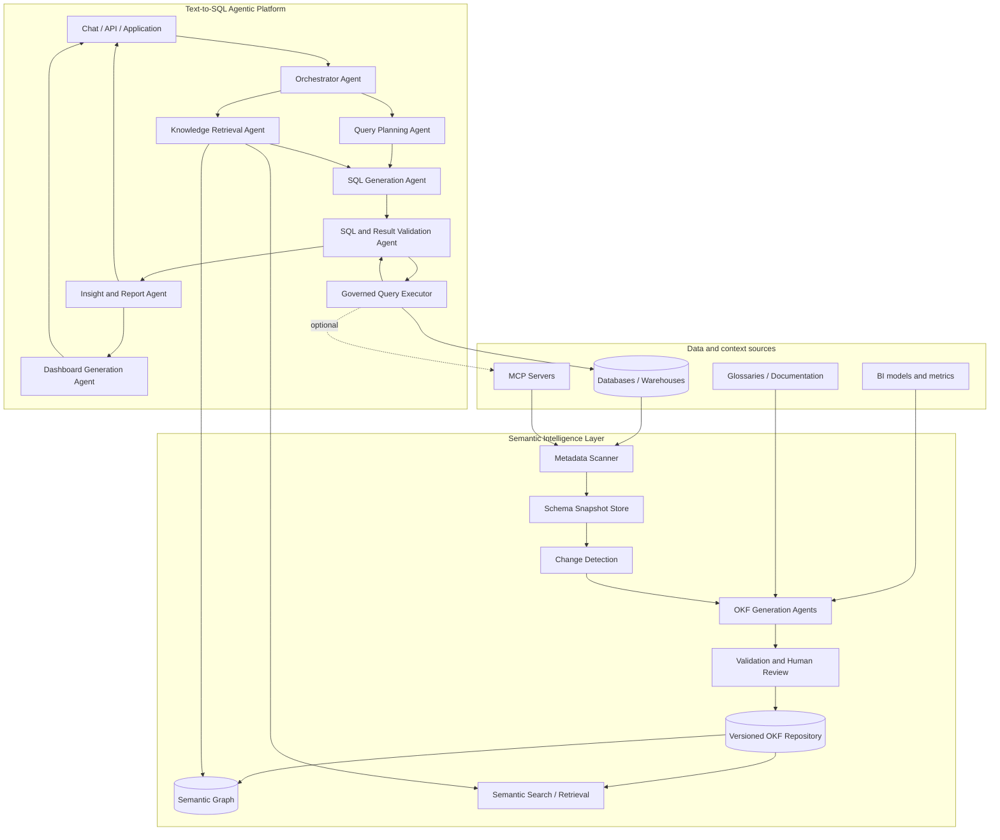

# Cerebro

**A Semantic Intelligence Layer and Text-to-SQL Agentic Platform for trusted data exploration, analysis, and reporting.**

Cerebro turns changing datasets into a living, machine-readable knowledge system and uses that knowledge to ground a coordinated team of data agents. It helps people move from a natural-language question to validated SQL, explainable results, and reusable reports or dashboards—without asking an LLM to guess what the data means.

> **The semantic layer is Cerebro's grounding foundation.** Every downstream agent retrieves from the same versioned definitions, relationships, constraints, and lineage before it plans, queries, validates, or explains an answer.

## Implemented five-day prototype

This branch contains a working, spec-driven semantic-layer slice for the bank workshop dataset:

- Google Cloud's full Open Knowledge Format repository is vendored as an unmodified Git subtree at commit `ad30107c31c06aec8a7d5636e0d1058118604e6f`.
- `DuckDBSource` implements Google's `Source` contract and reads only `information_schema` through a read-only connection.
- The checked-in `knowledge/bank-workshop` golden bundle describes 10 tables, 75 columns, 11 declared relationships, 9 business concepts, 4 metrics, and a sensitive-data policy.
- A bounded enrichment boundary supports two structured stages through a provider-neutral interface and an optional OpenAI Responses adapter.
- The in-memory retriever uses lexical ranking, optional `text-embedding-3-small` vectors, reciprocal-rank fusion, and typed one-hop graph expansion.
- FastAPI serves the bundle, graph, search, details, and grounding; MCP exposes the same grounding contract through local Streamable HTTP.
- The React/Cytoscape explorer provides an Obsidian-inspired, read-only semantic constellation with search, filters, keyboard navigation, one-hop focus, and a detailed inspector.

The production code traces to the seven contracts in [`specs/`](specs/README.md). Semantic definitions and design rationale remain in [`docs/semantic-layer-definition.md`](docs/semantic-layer-definition.md).

### Quick start

Requirements: Python 3.10 or newer, Node.js 20 or newer, and npm.

```bash
python3 -m pip install -e .
cd apps/web
npm install
npm run build
cd ../..
cerebro validate
cerebro evaluate
cerebro serve
```

Open <http://127.0.0.1:8000>. The Streamable HTTP MCP endpoint is `http://127.0.0.1:8000/mcp/`.

For live frontend development, install dependencies and run:

```bash
./scripts/dev.sh
```

This starts the API/MCP service on port 8000 and Vite on port 5173.

### Core commands

```bash
# Catalog-only discovery against config/bank-source.yaml
cerebro scan

# Uses live two-stage enrichment when OPENAI_API_KEY and the ai extra are present;
# otherwise reports the checked-in golden fallback without modifying it.
cerebro generate

# Validate Google OKF syntax plus Cerebro relationship/metric/link contracts
cerebro validate

# Evaluate all ten representative banking questions
cerebro evaluate
```

To enable the first live provider adapter:

```bash
python3 -m pip install -e '.[ai]'
export OPENAI_API_KEY=your_key
cerebro generate
```

The default generation model is `gpt-5.4-mini`; the default embedding model is `text-embedding-3-small`. Override them with `CEREBRO_OPENAI_MODEL` and `CEREBRO_EMBEDDING_MODEL`. No database rows are included in model input. Without credentials or the optional package, generation and retrieval remain fully functional using the golden OKF bundle and lexical-plus-graph retrieval.

### Runtime interfaces

| Interface | Purpose |
| --- | --- |
| `GET /api/bundles/active` | Active semantic version and object counts |
| `GET /api/graph` | Typed nodes and edges for visualization |
| `GET /api/concepts/{id}` | Complete OKF/Cerebro object detail |
| `GET /api/search?q=&types=` | Ranked semantic search |
| `POST /api/grounding` | Structured grounding packet for application clients |
| MCP `retrieve_grounding` | Concepts, tables, joins, metrics, warnings, classifications, and provenance |
| MCP `get_concept` | Stable-ID lookup |
| MCP `expand_neighborhood` | Typed graph expansion up to depth three |

Text-to-SQL generation and query execution intentionally remain separate. Cerebro returns the semantic evidence needed to ground that downstream system.

## Why Cerebro

Enterprise data is rarely self-explanatory. Tables change, business terms are ambiguous, joins encode institutional knowledge, and a syntactically valid query can still be wrong.

Cerebro addresses this by combining two closely connected capabilities:

1. **Semantic Intelligence Layer** — discovers schemas, detects changes, enriches technical metadata with business meaning, produces Open Knowledge Format (OKF) bundles, and exposes the resulting knowledge as search and graph experiences.
2. **Text-to-SQL Agentic Platform** — coordinates specialized agents that plan questions, retrieve knowledge, generate and validate SQL, execute queries through governed interfaces, and produce answers, reports, or dashboards.

The result is a feedback loop in which data changes update the knowledge layer, the knowledge layer grounds agent decisions, and validated usage improves the knowledge available to future queries.

## Platform architecture



The architecture separates **knowledge production** from **knowledge consumption**:

- The semantic pipeline continuously creates reliable, versioned knowledge about the data estate.
- The runtime agent system consumes that knowledge to answer questions safely and consistently.
- MCP servers can provide standardized access to datasets, catalogs, query engines, or other tools while Cerebro retains its own orchestration, policies, and semantic contracts.

## 1. Semantic Intelligence Layer

### Metadata scanning and schema snapshots

Source adapters inspect databases and warehouses to collect technical metadata such as:

- catalogs, schemas, tables, views, columns, and data types;
- primary keys, foreign keys, indexes, and constraints;
- view definitions, partitioning, freshness, and ownership;
- representative values and privacy-safe column statistics;
- existing descriptions, tags, metrics, and lineage.

Each scan produces an immutable schema snapshot. Snapshots make the state of a source reproducible and allow semantic artifacts to be tied to a known schema version.

### Change detection

The diff engine compares snapshots and emits explicit change events:

- tables or columns added, removed, or renamed;
- data types and nullability changed;
- keys, constraints, views, or relationships changed;
- descriptions, owners, classifications, or freshness changed;
- potential breaking changes and downstream impact.

Changes can trigger targeted regeneration instead of rebuilding the entire knowledge repository. High-risk changes can require review before updated knowledge is published.

### OKF generation agents

Specialized generation agents translate raw metadata and organizational context into an Open Knowledge Format knowledge repository. Their responsibilities include:

- **Concept discovery** — identifies business entities, events, measures, and dimensions.
- **Semantic enrichment** — writes clear definitions, aliases, usage guidance, and examples.
- **Relationship inference** — proposes joins, cardinalities, hierarchies, and entity links.
- **Metric definition** — captures formulas, grains, dimensions, time semantics, and caveats.
- **Policy classification** — records sensitivity, access expectations, and prohibited uses.
- **Lineage mapping** — connects source fields, derived models, metrics, and downstream artifacts.
- **Quality validation** — checks OKF completeness, consistency, references, and schema alignment.

Generated knowledge is treated as a proposed artifact, not unquestioned truth. Confidence, provenance, validation state, and human decisions should be recorded wherever possible.

### Versioned OKF repository

OKF bundles are the portable, human-readable contract between data producers and agents. A bundle can describe:

- source systems and datasets;
- business concepts and terminology;
- tables, columns, keys, and relationships;
- approved join paths and query patterns;
- metrics and calculation rules;
- lineage, ownership, freshness, and quality expectations;
- security classifications and usage constraints;
- examples, caveats, and validation evidence.

Keeping these artifacts in version control makes changes reviewable, auditable, and deployable alongside data models. The repository can also be indexed for hybrid retrieval and compiled into a semantic graph.

### Semantic graph and visualization

The graph builder projects OKF entities and relations into a navigable model. The visualization helps users and agents explore:

- how business concepts map to physical data;
- valid and risky join paths;
- metric dependencies and calculation lineage;
- upstream and downstream impact of schema changes;
- dataset domains, ownership, and access boundaries;
- disconnected, ambiguous, or weakly documented areas.

The graph is not only a UI. It is a reasoning substrate for retrieving connected context, selecting join routes, analyzing impact, and explaining how an answer was produced.

## 2. Text-to-SQL Agentic Platform

The query runtime uses a coordinator and bounded specialist agents. Agents exchange structured plans and evidence rather than relying on a single opaque prompt.

| Component | Responsibility |
| --- | --- |
| **Orchestrator Agent** | Owns the request lifecycle, delegates tasks, maintains state, applies policies, handles retries, and assembles the final response. |
| **Query Planning Agent** | Clarifies the analytical intent, decomposes complex questions, identifies measures, dimensions, filters, grain, and expected output. |
| **Knowledge Retrieval Agent** | Retrieves relevant OKF concepts, schema elements, metrics, join paths, examples, policies, and graph neighborhoods with provenance. |
| **SQL Generation Agent** | Produces dialect-aware SQL grounded in the approved plan and retrieved knowledge. It does not invent unavailable tables or fields. |
| **Validation Agent** | Checks SQL structure, referenced objects, join safety, metric definitions, access rules, cost, and result plausibility. It can request repair or clarification. |
| **Governed Query Executor** | Runs read-only or otherwise policy-approved queries against direct connections or MCP tools, with time, row, and cost limits. |
| **Insight and Report Agent** | Interprets validated results, highlights findings and caveats, and produces evidence-linked narrative reports. |
| **Dashboard Generation Agent** | Selects suitable visualizations and emits reusable dashboard specifications or integrations for supported BI tools. |

### Orchestration model

The orchestrator uses an explicit state machine or durable workflow rather than an unrestricted agent loop:

```text
UNDERSTAND
  -> RETRIEVE KNOWLEDGE
  -> PLAN
  -> GENERATE SQL
  -> VALIDATE
  -> EXECUTE
  -> VALIDATE RESULTS
  -> EXPLAIN / REPORT / VISUALIZE
  -> CAPTURE FEEDBACK
```

At any stage, the workflow may:

- request clarification when the business intent is ambiguous;
- reject a request that violates policy;
- retrieve more evidence when confidence is low;
- repair SQL after a validation or execution error;
- stop when retry, time, cost, or row limits are reached;
- route a semantic gap back to the knowledge authoring workflow.

## Dataset access and MCP

Cerebro can access data through native connectors, MCP servers, or both.

```text
Cerebro Agent Runtime
        |
        +-- Native connector -> PostgreSQL / BigQuery / Snowflake / DuckDB / ...
        |
        +-- MCP client ------> Catalog MCP server
                            -> Database query MCP server
                            -> BI or dashboard MCP server
```

MCP is useful as a standardized tool boundary: an MCP server can expose schema discovery, safe query execution, catalog lookup, or report publishing without embedding provider-specific logic in every agent. Cerebro should still enforce platform-level identity, authorization, query policy, audit logging, and result limits around those tools.

## End-to-end flows

### Knowledge generation flow

```text
1. Connect a data source
2. Scan metadata and collect a schema snapshot
3. Compare the snapshot with the previous version
4. Identify affected concepts and relationships
5. Run targeted OKF generation agents
6. Validate references, semantics, policies, and graph integrity
7. Request human review for uncertain or high-impact changes
8. Publish a versioned OKF bundle
9. Rebuild search indexes and the semantic graph
10. Notify downstream consumers of material changes
```

### Text-to-SQL query flow

```text
1. A user asks a business question
2. The orchestrator identifies intent and required output
3. The retrieval agent grounds the request in OKF and graph context
4. The planning agent defines grain, measures, dimensions, filters, and joins
5. The SQL agent generates a dialect-specific query
6. The validation agent checks semantics, safety, policy, and cost
7. The executor runs the approved query through a connector or MCP server
8. The validation agent evaluates result shape and plausibility
9. The report agent explains the answer with assumptions and provenance
10. When requested, the dashboard agent creates a reusable visualization spec
```

### Schema-change flow

```text
1. A scheduled scan detects a source change
2. The diff engine classifies severity and affected assets
3. Impact analysis finds dependent concepts, metrics, queries, and dashboards
4. Cerebro regenerates or flags affected OKF artifacts
5. Validation prevents stale or broken knowledge from being promoted
6. Runtime agents use the last valid version or surface a freshness warning
7. Approved updates are published and dependent indexes are refreshed
```

## Core components

| Area | Components |
| --- | --- |
| **Source integration** | Connector SDK, native database adapters, MCP client, credential and capability registry |
| **Discovery** | Introspection, profiling, sampling policy, snapshot store |
| **Change intelligence** | Schema diffing, event classification, impact analysis, notifications |
| **Semantic authoring** | OKF generation agents, prompt and model gateway, validators, review workflow |
| **Knowledge storage** | OKF repository, versioning, index builder, embeddings, graph store |
| **Query intelligence** | Orchestrator, planner, retriever, SQL generator, dialect adapters |
| **Trust and execution** | Policy engine, static SQL analysis, sandboxed execution, cost controls, result validation |
| **Experiences** | Chat, API, graph explorer, query workbench, reports, dashboard specifications |
| **Operations** | Observability, traces, evaluations, feedback, audit logs, model and prompt versions |

## Proposed project structure

```text
cerebro/
├── README.md
├── AGENTS.md
├── pyproject.toml
├── .env.example
├── docker-compose.yml
├── Makefile
│
├── config/
│   ├── cerebro.yaml
│   ├── sources.yaml
│   ├── models.yaml
│   └── policies.yaml
│
├── src/cerebro/
│   ├── cli.py
│   ├── api.py
│   ├── config.py
│   │
│   ├── sources/
│   │   ├── base.py
│   │   ├── registry.py
│   │   ├── postgres.py
│   │   ├── warehouse.py
│   │   └── models.py
│   │
│   ├── mcp/
│   │   ├── client.py
│   │   ├── capabilities.py
│   │   └── adapters.py
│   │
│   ├── scanner/
│   │   ├── introspector.py
│   │   ├── profiler.py
│   │   ├── snapshot.py
│   │   └── models.py
│   │
│   ├── change/
│   │   ├── diff.py
│   │   ├── events.py
│   │   ├── impact.py
│   │   └── models.py
│   │
│   ├── semantic/
│   │   ├── agents/
│   │   │   ├── concepts.py
│   │   │   ├── enrichment.py
│   │   │   ├── relationships.py
│   │   │   ├── metrics.py
│   │   │   └── policies.py
│   │   ├── prompts/
│   │   ├── pipeline.py
│   │   ├── review.py
│   │   └── validator.py
│   │
│   ├── okf/
│   │   ├── parser.py
│   │   ├── writer.py
│   │   ├── models.py
│   │   ├── index.py
│   │   └── validation.py
│   │
│   ├── knowledge/
│   │   ├── retrieval.py
│   │   ├── embeddings.py
│   │   ├── provenance.py
│   │   └── store.py
│   │
│   ├── graph/
│   │   ├── builder.py
│   │   ├── queries.py
│   │   ├── export.py
│   │   └── models.py
│   │
│   ├── agents/
│   │   ├── orchestrator.py
│   │   ├── planner.py
│   │   ├── retriever.py
│   │   ├── sql_generator.py
│   │   ├── validator.py
│   │   ├── reporter.py
│   │   └── dashboard.py
│   │
│   ├── execution/
│   │   ├── engine.py
│   │   ├── sql_analysis.py
│   │   ├── policies.py
│   │   ├── limits.py
│   │   └── results.py
│   │
│   ├── workflows/
│   │   ├── knowledge_generation.py
│   │   ├── text_to_sql.py
│   │   └── schema_change.py
│   │
│   ├── reports/
│   │   ├── narrative.py
│   │   ├── charts.py
│   │   └── dashboard_spec.py
│   │
│   └── observability/
│       ├── tracing.py
│       ├── audit.py
│       ├── feedback.py
│       └── evaluations.py
│
├── apps/
│   ├── api/
│   ├── chat/
│   └── graph-explorer/
│
├── knowledge/
│   ├── index.md
│   ├── sources/
│   ├── concepts/
│   ├── metrics/
│   └── relationships/
│
├── migrations/
├── prompts/
├── tests/
│   ├── unit/
│   ├── integration/
│   ├── golden/
│   └── evaluations/
└── examples/
    ├── ecommerce/
    └── analytics/
```

The structure is modular rather than service-per-folder by default. Components can remain in one deployable application during the MVP and be separated only when scale, isolation, or ownership requires it.

## MVP roadmap

### Phase 1 — Semantic foundation

- Support one analytical database and one SQL dialect.
- Scan schemas and save reproducible snapshots.
- Detect table, column, type, key, and relationship changes.
- Generate a minimal OKF repository with concepts, descriptions, and joins.
- Validate OKF references against the live schema.
- Render a searchable entity-relationship and concept graph.
- Support review and approval through version-controlled changes.

**Exit criterion:** a user can connect a dataset, inspect its graph, and review a valid, versioned semantic model.

### Phase 2 — Grounded Text-to-SQL

- Add the orchestrator, retrieval, planning, SQL generation, and validation agents.
- Execute read-only queries with time, row, and cost limits.
- Show the generated SQL, retrieved knowledge, assumptions, and provenance.
- Build a golden evaluation set covering joins, metrics, filters, and ambiguity.
- Capture user feedback and failed-query traces.

**Exit criterion:** representative business questions produce correct, explainable SQL and results against the MVP dataset.

### Phase 3 — Reports, dashboards, and MCP

- Generate narrative reports and chart recommendations from validated results.
- Emit a portable dashboard specification with reusable queries and filters.
- Add an MCP client and at least one governed MCP-based data or catalog integration.
- Track dependencies between questions, queries, metrics, reports, and dashboards.

**Exit criterion:** a user can turn a question into a saved, refreshable report or dashboard through either native or MCP-backed access.

### Phase 4 — Production intelligence

- Add more warehouses, SQL dialects, domains, and deployment targets.
- Introduce identity-aware policies, row or column controls, and enterprise audit integrations.
- Add durable workflows, caching, workload isolation, and model routing.
- Detect semantic drift and estimate schema-change impact on active artifacts.
- Continuously evaluate accuracy, safety, latency, cost, and answer usefulness.

**Exit criterion:** Cerebro can operate reliably across multiple governed data domains with measurable quality and operational controls.

## Design principles

1. **Semantics before generation.** Agents retrieve definitions, grain, relationships, and policies before producing SQL.
2. **Knowledge is a versioned product.** Semantic artifacts are reviewable, testable, auditable, and tied to source snapshots.
3. **Evidence over confidence theater.** Answers expose SQL, provenance, assumptions, validation results, and relevant knowledge.
4. **Bounded agency.** Tools, retries, execution modes, time, rows, and cost are constrained by explicit policies.
5. **Structured coordination.** Specialist agents communicate through typed state and artifacts, not free-form hidden conversations.
6. **Safe by default.** Query execution starts read-only and applies least privilege, data minimization, and sensitive-data controls.
7. **Human authority for business meaning.** Models can propose semantics; accountable owners approve contested definitions and high-impact changes.
8. **Portable interfaces.** OKF, SQL, APIs, and optional MCP tools reduce coupling to a single model, database, or orchestration framework.
9. **Graceful uncertainty.** Cerebro asks for clarification or declines to answer when evidence is missing or ambiguous.
10. **Evaluation is part of the product.** Semantic accuracy, SQL correctness, policy compliance, result quality, latency, and cost are continuously measured.

## Example user journeys

### Ask a business question

> “What was monthly net revenue by acquisition channel this year, and why did it fall in July?”

Cerebro resolves the approved definition of *net revenue*, finds the acquisition-channel dimension and valid join route, confirms the time grain and timezone, generates and validates SQL, executes it, and returns a chart with a concise explanation. The response includes the query, applied assumptions, metric provenance, and caveats.

### Resolve an ambiguous metric

> “Show me our best customers.”

Cerebro finds that “best” could mean lifetime value, recent revenue, margin, or retention. Instead of silently choosing, it presents the supported definitions and asks the user to select a measure and time window. The chosen meaning becomes part of the query plan and audit trail.

### Build a dashboard

> “Create a weekly operations dashboard for order volume, cancellation rate, fulfilment time, and regional exceptions.”

The orchestrator decomposes the request into governed metrics, retrieves their definitions and compatible dimensions, creates validated queries, and proposes charts, filters, thresholds, and refresh settings. The dashboard agent emits a reusable specification or publishes it through a supported integration.

### Onboard a new dataset

A data owner connects a warehouse schema. Cerebro scans it, profiles permitted fields, generates candidate concepts and relationships, and presents a graph with confidence and provenance. The owner edits ambiguous descriptions and approves the OKF change before it becomes available to runtime agents.

### Respond to a breaking schema change

A source column used by the “active customer” metric changes type. Cerebro detects the difference, identifies affected concepts, saved queries, and dashboards, blocks promotion of invalid knowledge, and alerts the relevant owner. Until the change is resolved, agents either use the last compatible semantic version with a freshness warning or decline affected requests.

### Investigate how an answer was produced

A reviewer opens an answer trace and follows the path from user question to query plan, retrieved OKF definitions, selected graph relationships, generated SQL, validation decisions, execution metadata, and final visualization. Each step is attributable to a model, prompt, tool, semantic version, and source snapshot.

## Trust, governance, and observability

A production Cerebro deployment should make every answer inspectable. At minimum, record:

- authenticated user and authorization context;
- source snapshot and OKF version;
- retrieved concepts, metrics, relationships, and policies;
- agent decisions, tool calls, prompts, and model versions;
- generated and executed SQL, with sensitive values redacted where required;
- validation outcomes, retries, execution time, rows, and estimated cost;
- report or dashboard dependencies;
- user corrections, approvals, and quality feedback.

Sensitive source data should not be copied into semantic artifacts by default. Sampling and profiling must be configurable, privacy-aware, and disabled for restricted columns or sources.

## Success measures

Cerebro should be evaluated as a complete knowledge-and-query system rather than only on whether SQL executes:

- semantic coverage and freshness;
- concept, relationship, and metric accuracy;
- executable SQL rate and result correctness;
- ambiguity detection and clarification quality;
- policy violation and unsafe-query prevention;
- explanation faithfulness and provenance completeness;
- time to onboard a dataset or repair a schema change;
- user acceptance, correction rate, latency, and cost.

## Vision

Cerebro is intended to become the trusted intelligence layer between an organization's data and its AI experiences. The long-term goal is not merely to generate SQL. It is to give every data agent a shared understanding of what the data means, how it connects, how it changes, and what it is safe to do—then turn that understanding into reliable analysis, reports, and decisions.
