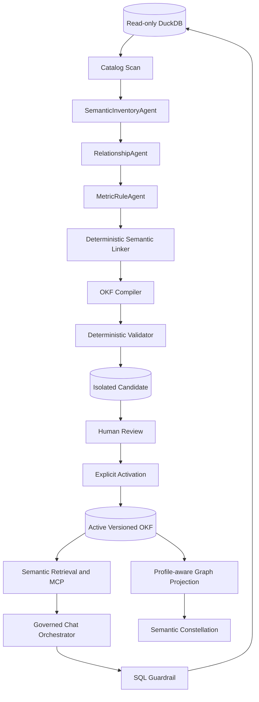

# Cerebro

**A Semantic Intelligence Layer and Text-to-SQL Agentic Platform for trusted data exploration, analysis, and reporting.**

Cerebro turns changing datasets into a living, machine-readable knowledge system and uses that knowledge to ground a coordinated team of data agents. It helps people move from a natural-language question to validated SQL, explainable results, and reusable reports or dashboards—without asking an LLM to guess what the data means.

> **The semantic layer is Cerebro's grounding foundation.** Every downstream agent retrieves from the same versioned definitions, relationships, constraints, and lineage before it plans, queries, validates, or explains an answer.

## Implemented five-day prototype

This branch contains a working, spec-driven semantic-layer slice for the bank workshop dataset:

- Google Cloud's full Open Knowledge Format repository is vendored as an unmodified Git subtree at commit `ad30107c31c06aec8a7d5636e0d1058118604e6f`.
- `DuckDBSource` implements Google's `Source` contract and reads only DuckDB catalog metadata through a read-only connection.
- The checked-in `knowledge/bank-workshop` golden bundle uses OKF v0.2 and Cerebro Semantic Profile v0.1. It describes 10 tables, 75 columns, 10 entities, 11 dimensions, 6 metrics, 6 business rules, 11 governed relationships, and 1 policy.
- Three bounded specialist stages propose the semantic inventory, relationship semantics, and metric/rule semantics through one configurable OpenAI-compatible model gateway. They receive catalog metadata without source rows.
- A deterministic linker, compiler, and validator reject invalid references before review. Approved copies become `stable`, record human verification, and remain separate from generated candidates.
- The in-memory retriever uses type-aware lexical ranking, optional embeddings, reciprocal-rank fusion, progressive semantic expansion, and shortest governed join paths.
- FastAPI serves semantic retrieval, runtime status, and governed database chat; MCP exposes the same grounding contract through local Streamable HTTP.
- The React workspace combines the read-only semantic constellation with a conversational Text-to-SQL experience that discloses SQL, results, evidence, warnings, and agent trace.

The production code traces to the contracts in [`specs/`](specs/README.md), including the [Semantic Profile v0.1 contract](specs/011-semantic-profile-v0.1.md). Semantic definitions and design rationale remain in [`docs/semantic-layer-definition.md`](docs/semantic-layer-definition.md). The complete manual test procedure is [`docs/product-tester-guide.md`](docs/product-tester-guide.md).

### Quick start

Requirements: Python 3.10 or newer, Node.js 20 or newer, and npm.

```bash
python3 -m pip install -e '.[ai]'
cp .env.example .env
cd apps/web
npm install
npm run build
cd ../..
cerebro validate
cerebro evaluate
cerebro serve
```

Open <http://127.0.0.1:8000>. The Streamable HTTP MCP endpoint is `http://127.0.0.1:8000/mcp/`.

For live frontend development, install dependencies and run:

```bash
./scripts/dev.sh
```

The launcher prefers `.venv/bin/python` when the project virtual environment exists. It starts the API/MCP service on port 8000 and Vite on port 5173, and exits with the backend error instead of starting Vite when the API cannot initialize.

In **Semantic constellation**, open **Semantic generation** and choose **Run full pipeline**. The workbench runs a raw DuckDB smoke test, restores the current server-process run after tab switches or a browser refresh, and exposes sanitized structured input/output for every stage. The active graph stays hidden until validation produces a separate candidate graph. The right rail remains dedicated to Pipeline while that candidate is previewed. Approval saves an immutable version; choosing the workspace default remains a separate action in **Versions**.

### Core commands

```bash
# Catalog-only discovery against config/bank-source.yaml
cerebro scan

# Generate a separate candidate using three live stages when configured,
# or a valid catalog/relationship-only candidate without credentials.
cerebro generate --output knowledge/generated/tester-001

# Run a raw database-only test. This never loads source YAML or checked-in knowledge.
cerebro generate --source-mode database-only --database /absolute/path/to/workshop.duckdb --output knowledge/generated/raw-001

# Validate, review, then explicitly activate the immutable reviewed copy.
cerebro validate --bundle knowledge/generated/tester-001
cerebro review --bundle knowledge/generated/tester-001 --reviewer 'Data Owner' --acknowledge-ai-risk
cerebro activate --bundle knowledge/reviewed/tester-001

# Validate Google OKF syntax plus all typed Cerebro profile contracts
cerebro validate

# Evaluate 30 typed semantic-grounding questions
cerebro evaluate

# Ask one governed database question from the terminal.
cerebro ask 'How many customers are there by gender?'
```

Configure any OpenAI-compatible chat-completions endpoint in the ignored `.env` file:

```dotenv
CEREBRO_DATABASE_PATH=/absolute/path/to/workshop.duckdb
CEREBRO_LLM_BASE_URL=https://api.openai.com/v1
CEREBRO_LLM_API_KEY=your_key
CEREBRO_LLM_MODEL=your_endpoint_supported_model
CEREBRO_LLM_RESPONSE_MODE=auto
CEREBRO_LLM_TIMEOUT_SECONDS=120
CEREBRO_LLM_MAX_OUTPUT_TOKENS=8192
CEREBRO_LLM_MAX_RETRIES=2
CEREBRO_LLM_RETRY_BACKOFF_SECONDS=2
```

If a build keeps failing with a timeout, connection, rate-limit, or server error from the model provider,
each generation agent call retries automatically with exponential backoff (`CEREBRO_LLM_MAX_RETRIES` attempts,
starting at `CEREBRO_LLM_RETRY_BACKOFF_SECONDS` and doubling). A failed run's error `code` (e.g. `llm_timeout`,
`llm_rate_limited`) tells you which of these it was after retries were exhausted; raise `CEREBRO_LLM_TIMEOUT_SECONDS`
or `CEREBRO_LLM_MAX_RETRIES` if your endpoint is simply slow on large catalogs.

Run `cerebro doctor` after changing configuration. Model and key changes require no source edits, and secrets are never returned to the browser. No database rows are included in OKF generation. Chat may send only bounded, policy-approved query results to the model; restricted fields and raw confidential values are blocked. Embeddings remain optional and lexical-plus-graph retrieval is the deterministic fallback.

### Runtime interfaces

| Interface | Purpose |
| --- | --- |
| `GET /api/bundles` | Golden plus every valid, immutable approved graph version and the workspace default |
| `GET /api/bundles/active` | Active semantic version and object counts |
| `GET /api/bundles/{id}/graph` | Preview one saved graph without changing the runtime |
| `GET /api/bundles/{id}/objects/{object_id}` | Inspect one object from a saved graph version |
| `PUT /api/bundles/default` | Explicitly set an approved saved graph or Golden as the workspace default |
| `GET /api/graph` | Typed nodes and edges for visualization |
| `GET /api/concepts/{id}` | Complete OKF/Cerebro object detail |
| `GET /api/search?q=&types=` | Ranked semantic search |
| `POST /api/grounding` | Structured grounding packet for application clients |
| `GET /api/runtime/status` | Redacted model, database, guardrail, and active-bundle readiness |
| `POST /api/chat` | Bounded conversation, validated read-only SQL, results, and evidence |
| `POST /api/generation/runs` | Start one configured or database-only candidate run |
| `GET /api/generation/runs/{id}` | Generation state, replayable events, and candidate summary |
| `GET /api/generation/runs/{id}/events` | Live Server-Sent Events progress stream |
| `GET /api/generation/runs/{id}/trace` | Ordered sanitized stage inputs and validated outputs |
| `GET /api/generation/runs/{id}/graph` | Validated candidate graph preview; never activates it |
| `GET /api/generation/runs/{id}/snapshot` | Sanitized catalog facts and discovery evidence |
| `GET /api/generation/runs/{id}/documents/{path}` | Generated candidate Markdown |
| `POST /api/generation/runs/{id}/reviews` | Record an idempotent whole-candidate approval or rejection |
| `POST /api/generation/runs/{id}/activate` | Verify and activate the immutable approved bundle |
| `GET /api/definitions/context?base_bundle_id=&revision_id=` | Guided authoring choices from an approved saved graph or open definition draft |
| `POST /api/definitions/translate` | Translate one metric or business-rule idea against an explicit graph scope |
| `POST /api/definition-revisions` | Fork an approved graph into a validated authored revision |
| `POST /api/definition-revisions/{id}/definitions` | Add another typed definition to the same draft revision |
| `POST /api/definition-revisions/{id}/reviews` | Approve and save, or reject, an authored revision |
| MCP `retrieve_grounding` | Entities, dimensions, metrics, rules, physical bindings, joins, warnings, classifications, and provenance |
| MCP `get_concept` | Stable-ID lookup |
| MCP `expand_neighborhood` | Typed graph expansion up to depth three |

In the Semantic Constellation workspace, approval saves an immutable copy without changing the runtime. Open **Versions** to compare Golden Bank Workshop v0.2.0 with approved generated graphs and Definition revisions, preview any graph, and explicitly set the workspace-wide default. Every graph preview has an **Inspect / Define** rail; Define can fork that exact approved version into a guided metric or business-rule revision. When an operator pins `CEREBRO_BUNDLE_PATH`, the version library remains available but default changes are disabled.

Text-to-SQL execution is limited to the configured local DuckDB source. The validator accepts one explicit-column `SELECT`, applies the semantic data policy, enforces time and row limits, and blocks writes and external access before execution.

## Why Cerebro

Enterprise data is rarely self-explanatory. Tables change, business terms are ambiguous, joins encode institutional knowledge, and a syntactically valid query can still be wrong.

Cerebro addresses this by combining two closely connected capabilities:

1. **Semantic Intelligence Layer** — discovers schemas, detects changes, enriches technical metadata with business meaning, produces Open Knowledge Format (OKF) bundles, and exposes the resulting knowledge as search and graph experiences.
2. **Text-to-SQL Agentic Platform** — coordinates specialized agents that plan questions, retrieve knowledge, generate and validate SQL, execute queries through governed interfaces, and produce answers, reports, or dashboards.

The result is a feedback loop in which data changes update the knowledge layer, the knowledge layer grounds agent decisions, and validated usage improves the knowledge available to future queries.

## Platform architecture

### Implemented architecture



The implemented builder is a fixed, bounded workflow—not an autonomous swarm. Each semantic agent makes one typed provider call from catalog-only input. It cannot read source rows, compile documents, validate, review, or activate. Deterministic components and human authority own those later boundaries.

The architecture separates **knowledge production** from **knowledge consumption**:

- The semantic pipeline creates an isolated, versioned candidate from the current catalog.
- Review and activation are separate recorded actions; downstream consumers continue using the active bundle until activation.
- The current chat runtime retrieves the active semantic contract, proposes one query, validates it, executes it read-only, and returns evidence-linked results.

### Future Text-to-SQL multi-agent target

The longer-term target may split runtime query work into intent, semantic planning, physical planning, SQL generation, validation, execution, and reporting agents. That topology is not the current semantic builder or current chat implementation. Source-row profiling, semantic/physical planner decomposition, SQL-architecture migration, dashboard agents, and durable remote orchestration remain future work.

## 1. Semantic Intelligence Layer

### Metadata scanning and schema snapshots

Source adapters inspect databases and warehouses to collect technical metadata such as:

- catalogs, schemas, tables, views, columns, and data types;
- primary keys, foreign keys, indexes, and constraints;
- view definitions, partitioning, freshness, and ownership;
- representative values and privacy-safe column statistics;
- existing descriptions, tags, metrics, and lineage.

Each scan produces an immutable schema snapshot. Snapshots make the state of a source reproducible and allow semantic artifacts to be tied to a known schema version.

### Change detection

The diff engine compares snapshots and emits explicit change events:

- tables or columns added, removed, or renamed;
- data types and nullability changed;
- keys, constraints, views, or relationships changed;
- descriptions, owners, classifications, or freshness changed;
- potential breaking changes and downstream impact.

Changes can trigger targeted regeneration instead of rebuilding the entire knowledge repository. High-risk changes can require review before updated knowledge is published.

### OKF generation agents

The implemented builder has exactly three bounded provider wrappers:

- **`SemanticInventoryAgent`** proposes entities, dimensions, table purposes, classifications, and reviewable policies.
- **`RelationshipAgent`** proposes catalog-bounded physical endpoints, optional entity endpoints, cardinality, confidence, and evidence.
- **`MetricRuleAgent`** proposes structured aggregate or ratio metrics, compatible dimensions, time semantics, and typed business rules.

`SemanticEnricher` sanitizes the snapshot once and calls them in that order. The deterministic linker resolves profile references, the OKF compiler writes a separate draft candidate, and the validator rejects invalid or incompatible targets before human review. Explicit activation is the only operation that changes the active bundle. Credential-free fallback emits structural dataset, table, and catalog-relationship documents without inventing business meaning.

### Versioned OKF repository

OKF bundles are the portable, human-readable contract between data producers and agents. A bundle can describe:

- source systems and datasets;
- business concepts and terminology;
- tables, columns, keys, and relationships;
- approved join paths and query patterns;
- metrics and calculation rules;
- lineage, ownership, freshness, and quality expectations;
- security classifications and usage constraints;
- examples, caveats, and validation evidence.

Keeping these artifacts in version control makes changes reviewable, auditable, and deployable alongside data models. The repository can also be indexed for hybrid retrieval and compiled into a semantic graph.

### Semantic graph and visualization

The graph builder projects OKF entities and relations into a navigable model. The visualization helps users and agents explore:

- entities and their physical table mappings;
- dimensions, owning entities, physical bindings, and compatible metrics;
- structured metrics, business rules, and their semantic or physical dependencies;
- canonical entity-to-entity relationships beside subordinate relationship audit nodes;
- physical joins with endpoint cardinalities;
- policy coverage, provenance, verification, and source documents.

The UI uses backend `profile_kind` for presentation and filtering while preserving raw OKF `type`. It supports All, Physical, Semantic, Metrics, and Governance presets plus per-kind filters for dataset, physical table, entity, dimension, metric, business rule, relationship, policy, legacy concept, and generic objects.

The graph is not only a UI. It is a reasoning substrate for retrieving connected context, selecting join routes, analyzing impact, and explaining how an answer was produced.

## 2. Future Text-to-SQL Agentic Platform

The following topology is the longer-term target, not a description of the currently implemented chat runtime. In the target, a coordinator and bounded specialist agents exchange structured plans and evidence rather than relying on a single opaque prompt.

| Component | Responsibility |
| --- | --- |
| **Orchestrator Agent** | Owns the request lifecycle, delegates tasks, maintains state, applies policies, handles retries, and assembles the final response. |
| **Query Planning Agent** | Clarifies the analytical intent, decomposes complex questions, identifies measures, dimensions, filters, grain, and expected output. |
| **Knowledge Retrieval Agent** | Retrieves relevant OKF concepts, schema elements, metrics, join paths, examples, policies, and graph neighborhoods with provenance. |
| **SQL Generation Agent** | Produces dialect-aware SQL grounded in the approved plan and retrieved knowledge. It does not invent unavailable tables or fields. |
| **Validation Agent** | Checks SQL structure, referenced objects, join safety, metric definitions, access rules, cost, and result plausibility. It can request repair or clarification. |
| **Governed Query Executor** | Runs read-only or otherwise policy-approved queries against direct connections or MCP tools, with time, row, and cost limits. |
| **Insight and Report Agent** | Interprets validated results, highlights findings and caveats, and produces evidence-linked narrative reports. |
| **Dashboard Generation Agent** | Selects suitable visualizations and emits reusable dashboard specifications or integrations for supported BI tools. |

### Orchestration model

The orchestrator uses an explicit state machine or durable workflow rather than an unrestricted agent loop:

```text
UNDERSTAND
  -> RETRIEVE KNOWLEDGE
  -> PLAN
  -> GENERATE SQL
  -> VALIDATE
  -> EXECUTE
  -> VALIDATE RESULTS
  -> EXPLAIN / REPORT / VISUALIZE
  -> CAPTURE FEEDBACK
```

At any stage, the workflow may:

- request clarification when the business intent is ambiguous;
- reject a request that violates policy;
- retrieve more evidence when confidence is low;
- repair SQL after a validation or execution error;
- stop when retry, time, cost, or row limits are reached;
- route a semantic gap back to the knowledge authoring workflow.

## Dataset access and MCP

Cerebro can access data through native connectors, MCP servers, or both.

```text
Cerebro Agent Runtime
        |
        +-- Native connector -> PostgreSQL / BigQuery / Snowflake / DuckDB / ...
        |
        +-- MCP client ------> Catalog MCP server
                            -> Database query MCP server
                            -> BI or dashboard MCP server
```

MCP is useful as a standardized tool boundary: an MCP server can expose schema discovery, safe query execution, catalog lookup, or report publishing without embedding provider-specific logic in every agent. Cerebro should still enforce platform-level identity, authorization, query policy, audit logging, and result limits around those tools.

## End-to-end flows

### Knowledge generation flow

```text
1. Scan the read-only catalog
2. Run SemanticInventoryAgent
3. Run RelationshipAgent with the inventory
4. Run MetricRuleAgent with inventory and relationships
5. Link semantic references deterministically
6. Compile a separate draft OKF candidate
7. Validate all physical and semantic contracts
8. Record a whole-candidate human review
9. Activate the immutable reviewed bundle explicitly
10. Rebuild retrieval and graph projections from the active bundle
```

### Text-to-SQL query flow

Future target:

```text
1. A user asks a business question
2. The orchestrator identifies intent and required output
3. The retrieval agent grounds the request in OKF and graph context
4. The planning agent defines grain, measures, dimensions, filters, and joins
5. The SQL agent generates a dialect-specific query
6. The validation agent checks semantics, safety, policy, and cost
7. The executor runs the approved query through a connector or MCP server
8. The validation agent evaluates result shape and plausibility
9. The report agent explains the answer with assumptions and provenance
10. When requested, the dashboard agent creates a reusable visualization spec
```

### Schema-change flow

```text
1. A scheduled scan detects a source change
2. The diff engine classifies severity and affected assets
3. Impact analysis finds dependent concepts, metrics, queries, and dashboards
4. Cerebro regenerates or flags affected OKF artifacts
5. Validation prevents stale or broken knowledge from being promoted
6. Runtime agents use the last valid version or surface a freshness warning
7. Approved updates are published and dependent indexes are refreshed
```

## Core components

| Area | Components |
| --- | --- |
| **Source integration** | Connector SDK, native database adapters, MCP client, credential and capability registry |
| **Discovery** | Introspection, profiling, sampling policy, snapshot store |
| **Change intelligence** | Schema diffing, event classification, impact analysis, notifications |
| **Semantic authoring** | OKF generation agents, prompt and model gateway, validators, review workflow |
| **Knowledge storage** | OKF repository, versioning, index builder, embeddings, graph store |
| **Query intelligence** | Orchestrator, planner, retriever, SQL generator, dialect adapters |
| **Trust and execution** | Policy engine, static SQL analysis, sandboxed execution, cost controls, result validation |
| **Experiences** | Chat, API, graph explorer, query workbench, reports, dashboard specifications |
| **Operations** | Observability, traces, evaluations, feedback, audit logs, model and prompt versions |

## Proposed project structure

```text
cerebro/
├── README.md
├── AGENTS.md
├── pyproject.toml
├── .env.example
├── docker-compose.yml
├── Makefile
│
├── config/
│   ├── cerebro.yaml
│   ├── sources.yaml
│   ├── models.yaml
│   └── policies.yaml
│
├── src/cerebro/
│   ├── cli.py
│   ├── api.py
│   ├── config.py
│   │
│   ├── sources/
│   │   ├── base.py
│   │   ├── registry.py
│   │   ├── postgres.py
│   │   ├── warehouse.py
│   │   └── models.py
│   │
│   ├── mcp/
│   │   ├── client.py
│   │   ├── capabilities.py
│   │   └── adapters.py
│   │
│   ├── scanner/
│   │   ├── introspector.py
│   │   ├── profiler.py
│   │   ├── snapshot.py
│   │   └── models.py
│   │
│   ├── change/
│   │   ├── diff.py
│   │   ├── events.py
│   │   ├── impact.py
│   │   └── models.py
│   │
│   ├── semantic/
│   │   ├── agents/
│   │   │   ├── concepts.py
│   │   │   ├── enrichment.py
│   │   │   ├── relationships.py
│   │   │   ├── metrics.py
│   │   │   └── policies.py
│   │   ├── prompts/
│   │   ├── pipeline.py
│   │   ├── review.py
│   │   └── validator.py
│   │
│   ├── okf/
│   │   ├── parser.py
│   │   ├── writer.py
│   │   ├── models.py
│   │   ├── index.py
│   │   └── validation.py
│   │
│   ├── knowledge/
│   │   ├── retrieval.py
│   │   ├── embeddings.py
│   │   ├── provenance.py
│   │   └── store.py
│   │
│   ├── graph/
│   │   ├── builder.py
│   │   ├── queries.py
│   │   ├── export.py
│   │   └── models.py
│   │
│   ├── agents/
│   │   ├── orchestrator.py
│   │   ├── planner.py
│   │   ├── retriever.py
│   │   ├── sql_generator.py
│   │   ├── validator.py
│   │   ├── reporter.py
│   │   └── dashboard.py
│   │
│   ├── execution/
│   │   ├── engine.py
│   │   ├── sql_analysis.py
│   │   ├── policies.py
│   │   ├── limits.py
│   │   └── results.py
│   │
│   ├── workflows/
│   │   ├── knowledge_generation.py
│   │   ├── text_to_sql.py
│   │   └── schema_change.py
│   │
│   ├── reports/
│   │   ├── narrative.py
│   │   ├── charts.py
│   │   └── dashboard_spec.py
│   │
│   └── observability/
│       ├── tracing.py
│       ├── audit.py
│       ├── feedback.py
│       └── evaluations.py
│
├── apps/
│   ├── api/
│   ├── chat/
│   └── graph-explorer/
│
├── knowledge/
│   ├── index.md
│   ├── sources/
│   ├── concepts/
│   ├── metrics/
│   └── relationships/
│
├── migrations/
├── prompts/
├── tests/
│   ├── unit/
│   ├── integration/
│   ├── golden/
│   └── evaluations/
└── examples/
    ├── ecommerce/
    └── analytics/
```

The structure is modular rather than service-per-folder by default. Components can remain in one deployable application during the MVP and be separated only when scale, isolation, or ownership requires it.

## MVP roadmap

### Phase 1 — Semantic foundation

- Support one analytical database and one SQL dialect.
- Scan schemas and save reproducible snapshots.
- Detect table, column, type, key, and relationship changes.
- Generate a minimal OKF repository with concepts, descriptions, and joins.
- Validate OKF references against the live schema.
- Render a searchable entity-relationship and concept graph.
- Support review and approval through version-controlled changes.

**Exit criterion:** a user can connect a dataset, inspect its graph, and review a valid, versioned semantic model.

### Phase 2 — Grounded Text-to-SQL

- Add the orchestrator, retrieval, planning, SQL generation, and validation agents.
- Execute read-only queries with time, row, and cost limits.
- Show the generated SQL, retrieved knowledge, assumptions, and provenance.
- Build a golden evaluation set covering joins, metrics, filters, and ambiguity.
- Capture user feedback and failed-query traces.

**Exit criterion:** representative business questions produce correct, explainable SQL and results against the MVP dataset.

### Phase 3 — Reports, dashboards, and MCP

- Generate narrative reports and chart recommendations from validated results.
- Emit a portable dashboard specification with reusable queries and filters.
- Add an MCP client and at least one governed MCP-based data or catalog integration.
- Track dependencies between questions, queries, metrics, reports, and dashboards.

**Exit criterion:** a user can turn a question into a saved, refreshable report or dashboard through either native or MCP-backed access.

### Phase 4 — Production intelligence

- Add more warehouses, SQL dialects, domains, and deployment targets.
- Introduce identity-aware policies, row or column controls, and enterprise audit integrations.
- Add durable workflows, caching, workload isolation, and model routing.
- Detect semantic drift and estimate schema-change impact on active artifacts.
- Continuously evaluate accuracy, safety, latency, cost, and answer usefulness.

**Exit criterion:** Cerebro can operate reliably across multiple governed data domains with measurable quality and operational controls.

## Design principles

1. **Semantics before generation.** Agents retrieve definitions, grain, relationships, and policies before producing SQL.
2. **Knowledge is a versioned product.** Semantic artifacts are reviewable, testable, auditable, and tied to source snapshots.
3. **Evidence over confidence theater.** Answers expose SQL, provenance, assumptions, validation results, and relevant knowledge.
4. **Bounded agency.** Tools, retries, execution modes, time, rows, and cost are constrained by explicit policies.
5. **Structured coordination.** Specialist agents communicate through typed state and artifacts, not free-form hidden conversations.
6. **Safe by default.** Query execution starts read-only and applies least privilege, data minimization, and sensitive-data controls.
7. **Human authority for business meaning.** Models can propose semantics; accountable owners approve contested definitions and high-impact changes.
8. **Portable interfaces.** OKF, SQL, APIs, and optional MCP tools reduce coupling to a single model, database, or orchestration framework.
9. **Graceful uncertainty.** Cerebro asks for clarification or declines to answer when evidence is missing or ambiguous.
10. **Evaluation is part of the product.** Semantic accuracy, SQL correctness, policy compliance, result quality, latency, and cost are continuously measured.

## Example user journeys

### Ask a business question

> “What was monthly net revenue by acquisition channel this year, and why did it fall in July?”

Cerebro resolves the approved definition of *net revenue*, finds the acquisition-channel dimension and valid join route, confirms the time grain and timezone, generates and validates SQL, executes it, and returns a chart with a concise explanation. The response includes the query, applied assumptions, metric provenance, and caveats.

### Resolve an ambiguous metric

> “Show me our best customers.”

Cerebro finds that “best” could mean lifetime value, recent revenue, margin, or retention. Instead of silently choosing, it presents the supported definitions and asks the user to select a measure and time window. The chosen meaning becomes part of the query plan and audit trail.

### Build a dashboard

> “Create a weekly operations dashboard for order volume, cancellation rate, fulfilment time, and regional exceptions.”

The orchestrator decomposes the request into governed metrics, retrieves their definitions and compatible dimensions, creates validated queries, and proposes charts, filters, thresholds, and refresh settings. The dashboard agent emits a reusable specification or publishes it through a supported integration.

### Onboard a new dataset

A data owner connects a warehouse schema. Cerebro scans it, profiles permitted fields, generates candidate concepts and relationships, and presents a graph with confidence and provenance. The owner edits ambiguous descriptions and approves the OKF change before it becomes available to runtime agents.

### Respond to a breaking schema change

A source column used by the “active customer” metric changes type. Cerebro detects the difference, identifies affected concepts, saved queries, and dashboards, blocks promotion of invalid knowledge, and alerts the relevant owner. Until the change is resolved, agents either use the last compatible semantic version with a freshness warning or decline affected requests.

### Investigate how an answer was produced

A reviewer opens an answer trace and follows the path from user question to query plan, retrieved OKF definitions, selected graph relationships, generated SQL, validation decisions, execution metadata, and final visualization. Each step is attributable to a model, prompt, tool, semantic version, and source snapshot.

## Trust, governance, and observability

A production Cerebro deployment should make every answer inspectable. At minimum, record:

- authenticated user and authorization context;
- source snapshot and OKF version;
- retrieved concepts, metrics, relationships, and policies;
- agent decisions, tool calls, prompts, and model versions;
- generated and executed SQL, with sensitive values redacted where required;
- validation outcomes, retries, execution time, rows, and estimated cost;
- report or dashboard dependencies;
- user corrections, approvals, and quality feedback.

Sensitive source data should not be copied into semantic artifacts by default. Sampling and profiling must be configurable, privacy-aware, and disabled for restricted columns or sources.

## Success measures

Cerebro should be evaluated as a complete knowledge-and-query system rather than only on whether SQL executes:

- semantic coverage and freshness;
- concept, relationship, and metric accuracy;
- executable SQL rate and result correctness;
- ambiguity detection and clarification quality;
- policy violation and unsafe-query prevention;
- explanation faithfulness and provenance completeness;
- time to onboard a dataset or repair a schema change;
- user acceptance, correction rate, latency, and cost.

## Vision

Cerebro is intended to become the trusted intelligence layer between an organization's data and its AI experiences. The long-term goal is not merely to generate SQL. It is to give every data agent a shared understanding of what the data means, how it connects, how it changes, and what it is safe to do—then turn that understanding into reliable analysis, reports, and decisions.
