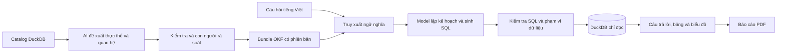

# Kịch bản giới thiệu và demo Cerebro — 7–10 phút

Bản soạn ngày 20/09/2026, đối chiếu mã nguồn và web local `http://127.0.0.1:5173`. Đối tượng nghe: giám khảo hoặc nhóm có cả người làm sản phẩm và kỹ thuật. Xưng “em”; có thể đổi thành “mình” hoặc “tôi”.

**Thông điệp chính:** Cerebro kết nối ý nghĩa nghiệp vụ với dữ liệu, để người dùng hỏi bằng tiếng Việt, xem kết quả có căn cứ và tạo báo cáo qua một luồng truy vấn có kiểm soát.

**Thời lượng mục tiêu: khoảng 9 phút 30 giây, đã dành chỗ cho thao tác.** Chỉ đọc phần **Lời nói**; phần thao tác, chuẩn bị và hỏi đáp không thuộc lời thuyết trình. Tập một lượt với đồng hồ vì tốc độ nói và thời gian model phản hồi có thể thay đổi.

## Chuẩn bị trước khi trình bày

- Mở web local, kiểm tra Text to SQL agents hiển thị `READY` và `5 / 5 READY`. Tại lúc kiểm tra, runtime dùng GreenNode, model `z-ai/glm-5.2-hackathon`, DuckDB và semantic bundle `bank-workshop` v0.2.0.
- Chuẩn bị ba tab: **A — Semantic constellation**, **B — Text to SQL agents**, **C — Report agent**. Việc chọn workspace thực hiện qua menu **Cerebro** ở góc trên trái. Dùng tab riêng giúp giữ nguyên màn hình cần trình bày.
- Trên tab B, chạy trước câu hỏi: **“Tỷ lệ gian lận theo từng loại thẻ là bao nhiêu?”** Giữ kết quả để dự phòng; khi demo có thể gửi lại. Không refresh hoặc Clear chat trên tab chứa kết quả dự phòng.
- Trên tab C, chạy trước yêu cầu: **“Tạo báo cáo gian lận thẻ gồm đúng 2 phần: tỷ lệ giao dịch thẻ gian lận trên toàn bộ dữ liệu; tỷ lệ gian lận theo từng loại thẻ.”** Đợi hoàn tất và tải PDF trước. Lần kiểm tra thực tế trả về đủ hai nội dung trong **một section** với 5 dòng kết quả; không hứa giao diện sẽ luôn tách thành hai section. Bản demo trực tiếp giới thiệu báo cáo đã tạo từ yêu cầu này; không cần chờ toàn bộ lần sinh mới trên sân khấu.
- Có thể mở thêm tab D ở **Customer self-service**, giữ mặc định **Manoj Garcia · Customer #46980**, hỏi trước: **“Số dư tài khoản hiện tại của tôi là bao nhiêu?”**
- Trên tab A, để graph ở trạng thái tổng quan, bỏ nội dung tìm kiếm cũ. Thử trước **Metrics → Card Fraud Rate** trong danh sách bên trái; đây là cách chọn node ổn định hơn dò vị trí trên canvas.
- Tăng cỡ chữ trình duyệt nếu máy chiếu khó đọc. Giữ nguyên bundle đang hoạt động trong suốt buổi demo.

## Kịch bản lời nói và thao tác

### 00:00–00:45 — Mở đầu: bài toán và giá trị

**Thao tác:** Hiển thị tab A với graph tổng quan. Chưa mở nhiều panel.

**Lời nói:**

“Chào mọi người, hôm nay em giới thiệu Cerebro, một nền tảng hỗ trợ khám phá và phân tích dữ liệu bằng ngôn ngữ tự nhiên.

Trong một hệ thống ngân hàng, dữ liệu nằm ở nhiều bảng: khách hàng, tài khoản, khoản vay và giao dịch thẻ. Muốn trả lời một câu hỏi nghiệp vụ, người phân tích phải biết lấy bảng nào, nối dữ liệu ra sao và dùng công thức nào.

Cerebro đưa những kiến thức đó vào một lớp ngữ nghĩa dùng chung. Từ lớp này, người dùng có thể hỏi bằng tiếng Việt, kiểm tra SQL và kết quả, rồi tạo báo cáo. Em sẽ minh họa xuyên suốt bằng bài toán tỷ lệ gian lận thẻ.”

### 00:45–02:05 — Semantic constellation: dữ liệu có ý nghĩa gì?

**Thao tác:** Chỉ các layer bên trái. Bấm **Metrics**, chọn **Card Fraud Rate** trong **Keyboard navigator**. Trong **Inspect**, kéo đến **Formula**, **Compatible dimensions** và **Governance and provenance**. Nếu đủ thời gian, chỉ nút **Open OKF source**.

**Lời nói:**

“Đây là Semantic constellation, giao diện khám phá lớp ngữ nghĩa. Bundle hiện tại có 75 đối tượng, trong đó có 10 bảng dữ liệu và 13 chỉ số nghiệp vụ.

Các đối tượng được chia thành nhóm như dữ liệu vật lý, thực thể, chiều phân tích, chỉ số, quy tắc và chính sách. Graph giúp người dùng lần theo các mối liên hệ; mình cũng có thể tìm kiếm, lọc layer và mở rộng vùng quanh một đối tượng.

Em chọn Card Fraud Rate. Phía bên phải mô tả chỉ số này là phần trăm giao dịch thẻ được đánh dấu gian lận. Công thức lấy số giao dịch có cờ gian lận chia cho tổng số giao dịch, rồi nhân một trăm.

Định nghĩa còn chỉ rõ bảng nguồn và những chiều được phép phân tích, như loại thẻ hoặc nhóm cửa hàng. Đây chính là căn cứ cho câu hỏi lát nữa.

Các định nghĩa được lưu theo Open Knowledge Format, gồm nội dung Markdown và metadata YAML. Nhờ đó, cả người đọc lẫn chương trình đều sử dụng được cùng một bộ kiến thức.”

### 02:05–03:00 — Tạo và quản lý lớp ngữ nghĩa

**Thao tác:** Mở **Semantic generation** để chỉ màn hình pipeline; sau đó mở **Versions**. Chỉ **Define** trên graph nếu thuận tiện. Không cần chạy generation hoặc đổi default trong buổi trình bày.

**Lời nói:**

“Cerebro cũng có quy trình tạo lớp ngữ nghĩa từ catalog của cơ sở dữ liệu.

Ở chế độ database-only đang hiển thị, các bước AI đề xuất thực thể, chiều phân tích và quan hệ từ catalog. Metric và business rule được để lại cho bước bổ sung định nghĩa sau đó. Đầu vào của quy trình này là metadata về cấu trúc dữ liệu, không phải các dòng dữ liệu khách hàng.

Sau đó, chương trình liên kết, biên dịch và kiểm tra các tham chiếu trước khi đưa ra bản ứng viên để con người xem xét.

Phê duyệt sẽ lưu một phiên bản riêng. Việc chọn phiên bản đó làm mặc định là một thao tác tiếp theo trong Versions. Người dùng còn có thể bổ sung metric hoặc business rule qua Define. Cách tổ chức này giúp việc cập nhật kiến thức có nguồn gốc và có bước rà soát rõ ràng.”

### 03:00–05:05 — Text to SQL: từ câu hỏi đến kết quả kiểm tra được

**Thao tác:** Chuyển tab B. Chọn câu hỏi preset ở nhóm **Trung bình**: **“Tỷ lệ gian lận theo từng loại thẻ là bao nhiêu?”** Trong lúc chờ, nói đoạn giải thích luồng. Khi có kết quả, mở **Generated SQL**, **Semantic evidence** và **Agent trace** lần lượt. Chỉ bảng và biểu đồ. Có thể bấm **Save** để minh họa lưu kết quả.

**Lời nói khi gửi câu hỏi:**

“Bây giờ em đặt câu hỏi: Tỷ lệ gian lận theo từng loại thẻ là bao nhiêu?

Người dùng chỉ cần nêu nhu cầu bằng tiếng Việt. Cerebro truy xuất các định nghĩa liên quan từ lớp ngữ nghĩa, sau đó đưa ngữ cảnh đó cho model để lập kế hoạch và sinh SQL.

Trước khi thực thi, SQL được kiểm tra bằng mã chương trình: bảng và cột có nằm trong phạm vi cho phép không, phép nối có hợp lệ không, có truy cập trường bị hạn chế hoặc thao tác ghi dữ liệu không. Truy vấn hợp lệ mới được chạy trên DuckDB bằng kết nối chỉ đọc.

Model đang phục vụ bản local này là GLM-5.2-hackathon thông qua GreenNode. Phần kết nối model được cấu hình ở backend, nên có thể đổi endpoint và model mà không phải viết lại giao diện.”

**Lời nói khi có kết quả:**

“Kết quả gồm câu trả lời, bảng số liệu và biểu đồ so sánh giữa các loại thẻ. Ở bộ dữ liệu demo hiện tại, tỷ lệ của các nhóm xấp xỉ nửa phần trăm.

Em mở Generated SQL để xem truy vấn đã chạy. Semantic evidence cho biết những đối tượng ngữ nghĩa được truy xuất cho câu trả lời, kèm phiên bản bundle. Agent trace cho phép kiểm tra các bước xử lý đã được ghi nhận.

Như vậy, người xem có thể đối chiếu câu trả lời với truy vấn và dữ liệu thực tế. Khi cần sử dụng lại, nút Save lưu ảnh chụp kết quả cùng thông tin truy vấn vào khu vực Saved.”

**Lời nối nếu model còn chạy:**

“Trong lúc hệ thống xử lý, em sẽ chỉ cách đọc một kết quả đã chạy trước với cùng câu hỏi.”

Chuyển sang kết quả dự phòng sau khoảng 20–30 giây chờ; không gửi liên tiếp nhiều yêu cầu.

### 05:05–06:15 — Report agent: tổng hợp nhiều câu hỏi

**Thao tác:** Chuyển tab C, hiển thị yêu cầu báo cáo đã chạy trước. Chỉ phần tổng quan, bảng kết quả chứa hai nội dung, **Generated SQL**, rồi **Export PDF**. Mở PDF đã tải nếu trình duyệt mất thời gian xuất mới.

**Lời nói:**

“Với nhu cầu tổng hợp hơn, Cerebro có Report agent. Em đã chuẩn bị một báo cáo về hai nội dung: tỷ lệ gian lận trên toàn bộ dữ liệu và tỷ lệ theo từng loại thẻ.

Hệ thống lập kế hoạch gồm một hoặc nhiều câu hỏi, xử lý qua cùng luồng truy vấn có kiểm soát, rồi tổng hợp phần nhận xét chung. Ví dụ này gộp hai nội dung trong một phần kết quả. Khi chạy, giao diện cập nhật tiến trình lập kế hoạch, xử lý từng phần và tổng hợp báo cáo.

Mỗi phần giữ lại kết quả, SQL và bằng chứng liên quan để người đọc có thể kiểm tra. Nếu có phần không trả lời được, hệ thống thể hiện trạng thái của phần đó và có thể trả về báo cáo hoàn thành một phần.

Cuối cùng, người dùng xuất PDF để chia sẻ hoặc đưa vào buổi họp. Đây là bước chuyển từ một câu hỏi phân tích đơn lẻ sang một tài liệu có cấu trúc.”

### 06:15–07:15 — Customer self-service: hỏi trong phạm vi cá nhân

**Thao tác:** Chuyển tab D hoặc mở **Customer self-service**. Chỉ **Log in as**, giữ khách hàng mặc định và hiển thị kết quả câu hỏi về số dư. Chỉ khu vực **Out-of-scope examples**; không bắt buộc chạy thêm một câu hỏi từ chối.

**Lời nói:**

“Workspace cuối cùng là Customer self-service. Người dùng có thể hỏi về tài khoản, thẻ, khoản vay và giao dịch của mình.

Ví dụ, với khách hàng đang chọn, em hỏi: Số dư tài khoản hiện tại của tôi là bao nhiêu?

Cùng một hệ thống xử lý câu hỏi, nhưng phạm vi dữ liệu được thu hẹp. Backend áp dụng bộ lọc theo mã khách hàng vào các bảng liên quan trước khi thực thi truy vấn. Các bảng nội bộ như nhân viên và chi nhánh bị chặn ở luồng này.

Bản hiện tại dùng đăng nhập mô phỏng để minh họa cách phân tách dữ liệu. Khi triển khai cho khách hàng thật, cần gắn danh tính này với hệ thống xác thực thực tế. Điểm em muốn thể hiện ở đây là cơ chế giới hạn phạm vi được thực hiện ở backend.”

### 07:15–08:55 — Công nghệ và cách triển khai

**Thao tác:** Quay lại tab B, chỉ **Runtime setup** và tên model. Nếu có slide kiến trúc, dùng sơ đồ ngắn bên dưới; không cần mở nhiều file mã nguồn.

**Lời nói:**

“Về công nghệ, Cerebro được chia thành giao diện, backend xử lý và lớp dữ liệu cùng tri thức.

Frontend sử dụng React, TypeScript và Vite. Graph dùng Cytoscape; phần tính bố cục cho graph lớn có thể chạy trong Web Worker để giảm công việc trên luồng giao diện.

Backend sử dụng Python và FastAPI. Pydantic kiểm tra cấu trúc dữ liệu trao đổi, SQLGlot phân tích SQL để thực hiện các kiểm tra trước khi truy vấn, còn DuckDB đảm nhiệm xử lý dữ liệu phân tích.

Lớp truy xuất kết hợp tìm kiếm từ khóa với quan hệ trong graph. Hệ thống có hỗ trợ embedding tùy chọn; cấu hình local đang dùng tìm kiếm từ khóa và graph. Bên cạnh HTTP API, Cerebro có giao diện MCP để các công cụ AI khác truy xuất tri thức ngữ nghĩa.

Về model, workflow chia công việc thành các bước có phạm vi rõ ràng. Backend vẫn chịu trách nhiệm kiểm tra và thực thi. Một số tối ưu đã có gồm gộp lập kế hoạch với sinh SQL trong cùng lượt gọi và tái sử dụng kế hoạch cho câu hỏi khách hàng phù hợp.

Về triển khai, project có Docker build nhiều giai đoạn, đóng gói frontend và backend, chạy bằng user không phải root và có health check. Repo có hướng dẫn triển khai lên GreenNode Agent Runtime, cùng một phương án vServer dùng Docker Compose và Caddy. Phần em vừa demo là môi trường local.”

### 08:55–09:30 — Kết thúc

**Thao tác:** Quay lại màn hình kết quả có biểu đồ hoặc trang đầu báo cáo PDF.

**Lời nói:**

“Qua phần demo, Cerebro thể hiện bốn khả năng: khám phá kiến thức dữ liệu, hỏi đáp bằng ngôn ngữ tự nhiên, tạo báo cáo và phục vụ câu hỏi theo phạm vi khách hàng.

Điểm em muốn nhấn mạnh là một luồng xuyên suốt: định nghĩa nghiệp vụ làm nền tảng, AI hỗ trợ chuyển câu hỏi thành truy vấn, chương trình kiểm tra trước khi chạy, và người dùng có thể xem lại kết quả cùng căn cứ xử lý.

Đó là hướng Cerebro hỗ trợ việc phân tích dữ liệu thuận tiện hơn và dễ kiểm tra hơn. Em cảm ơn mọi người.”

## Sơ đồ dùng cho một slide kỹ thuật

Sơ đồ rút gọn theo chế độ database-only trên giao diện: metric/rule được bổ sung qua Define và quy trình review phiên bản. Report agent lập kế hoạch riêng và gọi lại luồng chat cho từng phần; PDF là đầu ra của báo cáo đó.

## Điều chỉnh thời lượng

| Phần | Bản 7 phút | Bản 9 phút 30 giây |
| --- | ---: | ---: |
| Mở đầu | 0:35 | 0:45 |
| Semantic graph | 1:00 | 1:20 |
| Generation / Versions / Define | 0:30 | 0:55 |
| Text to SQL | 1:40 | 2:05 |
| Report | 0:50 | 1:10 |
| Customer | 0:45 | 1:00 |
| Công nghệ và triển khai | 1:10 | 1:40 |
| Kết thúc | 0:30 | 0:35 |
| **Tổng** | **7:00** | **9:30** |

Để còn 7 phút: bỏ Open OKF source, không thao tác Define hoặc Save, chỉ mở SQL trong chat, dùng báo cáo và kết quả khách hàng đã chuẩn bị. Rút phần công nghệ về React/TypeScript, Python/FastAPI, DuckDB, SQLGlot, GreenNode và Docker. Nếu có đủ 10 phút, dành 30 giây còn lại mở Semantic evidence hoặc phóng to một phần PDF.

## Ghi chú chính xác về bản hiện tại

- Số lượng **75 đối tượng, 13 metric, 12 business rule, 3 policy, 10 bảng** được đọc từ graph local ngày kiểm tra. Một số số lượng ở phần đầu README phản ánh bundle cũ hơn. Nếu đổi bundle, kiểm tra lại trước khi đọc con số này.
- Câu hỏi gian lận thẻ đã chạy thành công trên web local: Credit - Classic khoảng **0,5071%**, Credit - Gold **0,4989%**, Debit **0,4972%**, Credit - Platinum **0,4769%**. Khi demo, ưu tiên đọc số đang hiển thị; đây là dữ liệu workshop, không phải kết luận về một ngân hàng thật.
- Không giới thiệu Cerebro như một model tự huấn luyện. Đây là ứng dụng kết nối model có sẵn qua gateway; model local đang cấu hình là `z-ai/glm-5.2-hackathon`.
- Nhãn `5-agent bounded runtime` trên giao diện là cách trình bày các vai trò xử lý. Luồng chat thực tế do `ChatOrchestrator` điều phối; không nên diễn giải thành năm model độc lập chạy song song. Mã nguồn có `SemanticInventoryAgent`, `RelationshipAgent` và `MetricRuleAgent`, nhưng pipeline database-only trên web hoãn bước metric/rule để bổ sung qua Define.
- Kiểm tra local đã xác nhận câu hỏi khách hàng trả lời được, báo cáo trạng thái `COMPLETED` và endpoint PDF trả về HTTP 200 với nội dung PDF. Báo cáo thử nghiệm gộp hai yêu cầu vào một section; số section do kế hoạch thực tế quyết định, cần xem trước khi trình bày.
- Generation chỉ đưa catalog metadata vào model. Luồng chat có thể đưa kết quả truy vấn bị giới hạn và được policy cho phép vào bước diễn đạt câu trả lời; không nói “mọi dữ liệu luôn ở local”.
- Semantic evidence là các đối tượng ngữ nghĩa được truy xuất. Agent trace là dấu vết xử lý của ứng dụng, không phải toàn bộ suy nghĩ bên trong model. Thanh tiến trình chat dùng mốc thời gian ước lượng; tiến trình report và generation dùng SSE.
- Saved lưu snapshot kết quả; không mô tả thành dashboard tự cập nhật. Report yêu cầu model tổng hợp từ kết quả từng phần; không khẳng định cơ chế này bảo đảm tuyệt đối mọi nhận xét đều đúng.
- Customer self-service hiện là đăng nhập mô phỏng với mã khách hàng từ giao diện. Có lọc dòng phía backend, nhưng chưa phải hệ thống định danh khách hàng hoàn chỉnh để công bố sẵn sàng production.
- Có cấu hình và hướng dẫn deploy trong repo; buổi kiểm tra này không xác minh một deployment cloud đang hoạt động. Không nói “push GitHub là tự động deploy”; workflow release hiện dùng kích hoạt thủ công.
- Demo graph/generation chỉ cần xem giao diện. Nếu muốn minh họa đầy đủ sinh → review → activate, nên dành một buổi riêng hoặc video ngắn để không vượt 10 phút.

## Câu trả lời ngắn khi được hỏi thêm

**“Điểm khác biệt so với đưa schema cho chatbot là gì?”**

“Cerebro bổ sung định nghĩa metric, quy tắc nghiệp vụ, quan hệ và policy có phiên bản để làm ngữ cảnh. Người dùng còn xem được SQL, kết quả và các bước xử lý, đồng thời backend kiểm tra truy vấn trước khi thực thi.”

**“AI có tự sửa dữ liệu không?”**

“Luồng demo truy vấn qua kết nối DuckDB chỉ đọc. Backend kiểm tra SQL và chặn thao tác ghi hoặc truy cập ngoài phạm vi trước khi chạy.”

**“Có bảo đảm câu trả lời luôn đúng không?”**

“Không có cam kết tuyệt đối. Hệ thống giảm rủi ro bằng định nghĩa được rà soát, kiểm tra SQL và công khai kết quả để đối chiếu. Những câu hỏi chưa rõ có thể cần làm rõ, và định nghĩa nghiệp vụ vẫn cần người chịu trách nhiệm kiểm tra.”

**“Có bắt buộc dùng GreenNode hoặc GLM không?”**

“Bản demo đang dùng GreenNode và GLM. Gateway hỗ trợ endpoint tương thích OpenAI; khả năng tương thích cụ thể cần kiểm tra khi đổi provider hoặc model.”

**“Graph có dùng Neo4j không?”**

“Bản hiện tại dựng graph từ các đối tượng và quan hệ trong bundle OKF, truy xuất trong bộ nhớ và hiển thị bằng Cytoscape. Dữ liệu truy vấn nằm trong DuckDB.”

**“Hệ thống đã sẵn sàng cho ngân hàng thật chưa?”**

“Đây là prototype có các luồng hoạt động và cấu hình triển khai. Để dùng với khách hàng thật cần hoàn thiện xác thực, phân quyền gắn với danh tính tin cậy, vận hành và kiểm định trên dữ liệu cùng yêu cầu thực tế.”

## Nguồn đối chiếu trong repository

- Tổng quan: [README](../README.md), [hướng dẫn giao diện](ui-and-okf-guide.vi.md).
- Giao diện và thao tác: [App.tsx](../apps/web/src/App.tsx), [GraphView](../apps/web/src/GraphView.tsx), [ReportPanel](../apps/web/src/ReportPanel.tsx), [CustomerWorkspace](../apps/web/src/CustomerWorkspace.tsx).
- Runtime chat và kiểm tra SQL: [chat.py](../src/cerebro/chat.py), [customer_scope.py](../src/cerebro/customer_scope.py), [retrieval.py](../src/cerebro/retrieval.py).
- Sinh tri thức: [semantic/agents.py](../src/cerebro/semantic/agents.py), [generation.py](../src/cerebro/generation.py).
- Báo cáo: [report_agent.py](../src/cerebro/report_agent.py), [report_pdf.py](../src/cerebro/report_pdf.py).
- Định nghĩa ví dụ: [Card Fraud Rate](../knowledge/bank-workshop/metrics/card-fraud-rate.md).
- Triển khai: [Dockerfile](../Dockerfile), [Compose](../deploy/compose.production.yaml), [GreenNode Agent Runtime](deployment-greennode-agent-runtime.md), [release workflow](../.github/workflows/release-container.yml).
