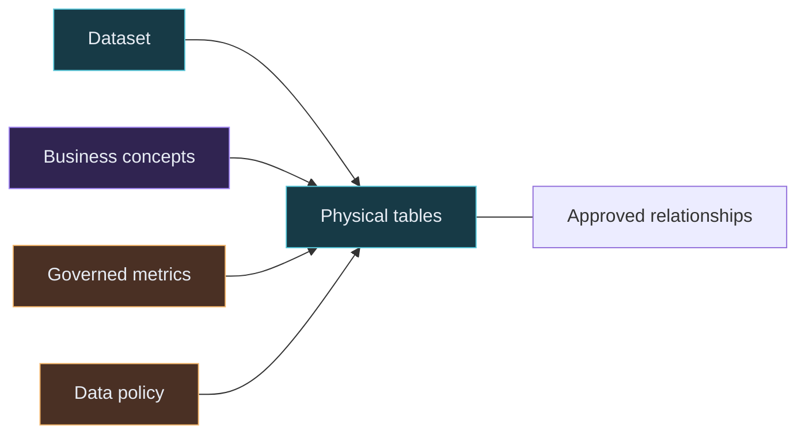

# Understanding the Cerebro UI and Its OKF Relationships

This guide explains how to read the Cerebro semantic-constellation UI, how the
objects and lines relate to the checked-in Open Knowledge Format (OKF) bundle,
and how to trace a business question from meaning to physical data.

## Start the UI

From the repository root, run:

```bash
./scripts/dev.sh
```

Then open <http://127.0.0.1:5173>.

The development script starts both parts of the application:

- The React/Vite UI at <http://127.0.0.1:5173>.
- The FastAPI semantic service at <http://127.0.0.1:8000>.

The UI is read-only. It helps you explore reviewed semantic knowledge; it does
not edit OKF files or execute SQL.

## The main idea

The UI is a visual projection of the files under
[`knowledge/bank-workshop/`](../knowledge/bank-workshop/index.md). Each graph
node represents one OKF object and each graph edge represents a declared
connection between objects.



Read the graph from left to right conceptually:

1. **Physical structures** say what data exists and at what grain.
2. **Business meaning** explains how the physical data should be interpreted.
3. **Governed metrics and policies** define safe calculations and handling
   rules.

The automatic graph layout can put nodes anywhere on the canvas, so physical
left-to-right position is not a strict hierarchy. The connections and node
types carry the meaning.

## Read the three areas of the UI

### 1. Discovery rail on the left

Use this area to narrow the graph:

- **Search** matches text in an object's name, stable ID, and description.
- **Object layers** show or hide whole object types.
- **Object count** beside each filter shows how many objects of that type are
  in the active bundle.
- **Navigator** lists the currently visible objects. Select an item with a
  pointer, or use `Tab` and `Enter` from the keyboard.

Search and filters only change the visible projection. They do not modify the
OKF bundle.

### 2. Graph canvas in the center

The canvas shows objects and their relationships:

- Drag the background to pan.
- Scroll to zoom.
- Select a node to focus its one-hop neighborhood.
- Unrelated nodes and edges fade after selection.
- The focused edges display their labels.
- Use **Fit graph** in the top-right corner to fit the visible graph.
- Use **Reset view** to clear search, filters, selection, and graph position.

The layout is generated when the graph loads. Node placement may change between
reloads without any change to the underlying OKF relationships.

### 3. Inspector on the right

Selecting a node loads its complete semantic object. Depending on the object
type, the inspector can show:

- Stable ID, definition, and lifecycle status.
- Table grain, fields, data types, and classifications.
- Concept mappings and dependencies.
- Metric formulas.
- Query guidance and warnings.
- Governance classification and provenance.

Use **Open OKF source** at the bottom to open the Markdown document that
produced the selected node. This is the best way to move from the visual
summary to the full source definition.

## Node types and their source folders

The graph uses both color and shape to distinguish the six object types.

| UI object | Visual encoding | Meaning | OKF source |
| --- | --- | --- | --- |
| Dataset | Cyan rounded rectangle | The source-level collection and its scope | [`datasets/`](../knowledge/bank-workshop/datasets/index.md) |
| Table | Teal rectangle | A physical table, its columns, key, grain, and warnings | [`tables/`](../knowledge/bank-workshop/tables/index.md) |
| Concept | Violet circle | A business term mapped to physical data | [`concepts/`](../knowledge/bank-workshop/concepts/index.md) |
| Relationship | Gray diamond | An approved join contract between tables | [`relationships/`](../knowledge/bank-workshop/relationships/index.md) |
| Metric | Amber hexagon | A governed calculation with dependencies and grain | [`metrics/`](../knowledge/bank-workshop/metrics/index.md) |
| Policy | Rose tag | Classification or usage rules applied to data | [`policies/`](../knowledge/bank-workshop/policies/index.md) |

Columns are intentionally shown inside a table's inspector rather than as
separate nodes. This keeps the graph readable while preserving field-level
information.

## What each line means

The API derives typed graph edges from the `links` and `cerebro` fields in each
OKF file.

| Edge type | Connects | Source declaration | How to interpret it |
| --- | --- | --- | --- |
| `physical_fk` | Table to table | A relationship's `source_table` and `target_table` | These tables have an approved join path; the selected edge label shows cardinality such as `many-to-one`. |
| `relationship_endpoint` | Relationship node to each table | The same relationship endpoints | This join-contract object governs these two tables. |
| `semantic_mapping` | Dataset or concept to another object | `links` and concept `maps_to` | This business or source-level object is grounded in the connected object. |
| `metric_dependency` | Metric to a table or semantic object | Metric `links` and `dependencies` | The metric requires this object to be calculated correctly. |
| `policy_coverage` | Policy to a covered object | Policy `links` and `applies_to` | The policy's rules apply to the connected object. |

Graph connections are treated as bidirectional for neighborhood exploration,
even when an arrow communicates the declared semantic direction. Selecting a
node therefore reveals both what it points to and what points to it.

Some reverse table links are deliberately omitted when the same connection is
already represented by the dataset, relationship, or policy object. This
reduces duplicate lines; it does not remove information from the OKF source.

## A practical walkthrough: card fraud

Use this path to learn how the layers work together:

1. Enter `card fraud` in the search box.
2. Select **Card fraud** (`concept.card-fraud`).
3. Observe its mapped physical objects, especially **Card Transactions** and
   **Cards**, plus the **Card fraud rate** metric.
4. Select **Card Transactions** (`table.card_transactions`). In the inspector,
   check the grain: one purchase or withdrawal event per card. Review fields
   such as `card_id`, `amount`, and `is_fraud`.
5. Select **Card Transaction Card**
   (`relationship.card_transaction_card`). Its definition identifies the
   approved `card_transactions.card_id = cards.card_id` join. Then select
   **Card Transactions** and read `many-to-one` on the focused physical edge to
   **Cards**.
6. Select **Card fraud rate** (`metric.card-fraud-rate`). Read its formula,
   dependency, aggregate grain, and safe-division warning.
7. Select **Sensitive banking data**
   (`policy.sensitive-banking-data`). Confirm that the policy covers the tables
   in this path and requires aggregate results with restricted fields
   minimized.
8. Use **Open OKF source** on any selected object to compare the inspector with
   its Markdown frontmatter.

That path answers five different questions:

| Question | Object that answers it |
| --- | --- |
| What does “card fraud” mean? | Concept |
| Which rows and fields contain the evidence? | Table |
| How can another table be joined safely? | Relationship |
| How is the rate calculated? | Metric |
| How may the result be handled? | Policy |

## How Markdown becomes the UI

For example, the card-fraud concept declares physical and metric mappings in
its YAML frontmatter:

```yaml
type: concept
id: concept.card-fraud
name: Card fraud
links:
  - table.card_transactions
  - table.cards
  - metric.card-fraud-rate
cerebro:
  maps_to:
    - table.card_transactions
    - table.cards
    - metric.card-fraud-rate
  classification: confidential
```

The application turns that source into the UI through this flow:

```mermaid
flowchart LR
    OKF[OKF Markdown files] --> LOAD[Validated semantic bundle]
    LOAD --> RETRIEVER[Typed graph projection]
    RETRIEVER --> API[GET /api/graph]
    RETRIEVER --> DETAIL[GET /api/concepts/{id}]
    API --> CANVAS[Graph canvas]
    DETAIL --> INSPECTOR[Object inspector]
```

The important field mappings are:

| OKF field | UI result |
| --- | --- |
| `type` | Node shape, color, and filter category |
| `id` | Stable identifier and graph node identity |
| `name` | Node label and inspector heading |
| `description` | Searchable text and inspector definition |
| `status` | Governance status |
| `links` | General graph connections |
| `provenance` | Inspector provenance |
| `cerebro.grain` | Table or metric grain |
| `cerebro.columns` | Table field list |
| `cerebro.maps_to` | Semantic mappings |
| `cerebro.dependencies` | Metric dependencies |
| `cerebro.formula` | Metric formula |
| `cerebro.warnings` | Query guidance |
| `cerebro.classification` | Governance classification |
| `cerebro.applies_to` | Policy coverage |

## Inspect the same information without the UI

List all bundle files:

```bash
find knowledge/bank-workshop -maxdepth 2 -type f | sort
```

Inspect the graph projection returned to the UI:

```bash
curl http://127.0.0.1:8000/api/graph
```

Inspect one complete object:

```bash
curl http://127.0.0.1:8000/api/concepts/concept.card-fraud
```

Check the active bundle and object counts:

```bash
curl http://127.0.0.1:8000/api/bundles/active
```

## Current boundaries

- The explorer is read-only; edit the Markdown source to change semantics.
- The UI displays direct, one-hop context after selection, not an entire query
  plan.
- Visual proximity alone does not imply a relationship; trust the connecting
  line and inspector details.
- A line proves that a relationship is declared in the bundle, not that a
  database foreign-key constraint exists. Check relationship provenance and
  warnings for that distinction.
- The explorer does not generate or execute SQL. Its purpose is to expose the
  semantic evidence a downstream Text-to-SQL system should use.

For the broader design rationale, see
[`semantic-layer-definition.md`](semantic-layer-definition.md). For the UI
contract and intended behavior, see
[`006-knowledge-graph-ui.md`](../specs/006-knowledge-graph-ui.md).
