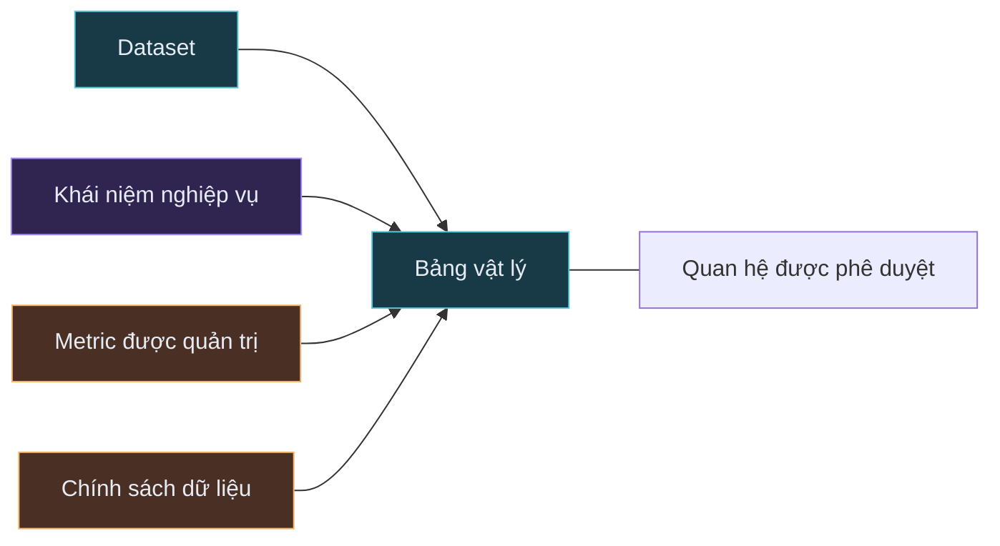

# Hướng dẫn hiểu giao diện Cerebro và các quan hệ OKF

Tài liệu này giải thích cách đọc giao diện semantic constellation của Cerebro,
cách các đối tượng và đường nối liên hệ với bộ Open Knowledge Format (OKF) trong
repository, và cách lần theo một câu hỏi nghiệp vụ từ ý nghĩa đến dữ liệu vật
lý.

## Khởi động giao diện

Từ thư mục gốc của repository, chạy:

```bash
./scripts/dev.sh
```

Sau đó mở <http://127.0.0.1:5173>.

Script phát triển khởi động cả hai thành phần:

- Giao diện React/Vite tại <http://127.0.0.1:5173>.
- Dịch vụ semantic FastAPI tại <http://127.0.0.1:8000>.

Giao diện chỉ dùng để đọc. Nó giúp khám phá tri thức semantic đã được rà soát;
nó không chỉnh sửa file OKF và không thực thi SQL.

## Ý tưởng chính

Giao diện là hình chiếu trực quan của các file trong
[`knowledge/bank-workshop/`](../knowledge/bank-workshop/index.md). Mỗi node trên
graph đại diện cho một đối tượng OKF, và mỗi edge đại diện cho một kết nối đã
được khai báo giữa các đối tượng.



Về mặt khái niệm, hãy đọc graph từ trái sang phải:

1. **Cấu trúc vật lý** cho biết dữ liệu nào tồn tại và grain của dữ liệu.
2. **Ý nghĩa nghiệp vụ** giải thích cách diễn giải dữ liệu vật lý.
3. **Metric và chính sách được quản trị** định nghĩa phép tính an toàn và quy
   tắc xử lý dữ liệu.

Bố cục tự động có thể đặt node ở bất kỳ vị trí nào trên canvas, vì vậy vị trí
trái-phải không phải là một phân cấp cứng. Kiểu node và các đường kết nối mới là
những yếu tố mang ý nghĩa.

## Đọc ba khu vực chính của giao diện

### 1. Thanh khám phá bên trái

Dùng khu vực này để thu hẹp graph:

- **Search** tìm trong tên, stable ID và mô tả của đối tượng.
- **Object layers** hiển thị hoặc ẩn toàn bộ một loại đối tượng.
- **Số lượng đối tượng** bên cạnh mỗi bộ lọc cho biết có bao nhiêu đối tượng
  thuộc loại đó trong bundle đang hoạt động.
- **Keyboard navigator** nhóm các đối tượng đang hiển thị vào những mục thu gọn
  có mã màu như **Tables**, **Concepts** và **Metrics**. Mỗi mục hiển thị số
  lượng đối tượng đang thấy. Chọn một đối tượng bằng chuột hoặc dùng `Tab` và
  `Enter` từ bàn phím.

Tìm kiếm và bộ lọc chỉ thay đổi hình chiếu đang hiển thị. Chúng không sửa đổi
bundle OKF.

### 2. Graph canvas ở giữa

Canvas hiển thị các đối tượng và quan hệ giữa chúng:

- Kéo vùng nền để di chuyển graph.
- Cuộn để phóng to hoặc thu nhỏ.
- Chọn một node để tập trung vào các đối tượng cách nó một bước kết nối.
- Các node và edge không liên quan sẽ mờ đi sau khi chọn.
- Các edge đang được tập trung sẽ hiển thị nhãn.
- Physical join giữa các table luôn ghi **one** hoặc **many** tại mỗi endpoint
  theo cardinality đã khai báo. Mũi tên teal biểu thị source → target; chính
  các nhãn endpoint, không phải riêng mũi tên, xác định phía one/many.
- Dùng **Fit graph** ở góc trên bên phải để đưa toàn bộ graph đang hiển thị vào
  khung nhìn.
- Dùng **Reset view** để xóa tìm kiếm, bộ lọc, lựa chọn và đặt lại khung nhìn.

Bố cục được tạo khi graph được tải. Vị trí node có thể thay đổi giữa các lần
tải lại dù các quan hệ OKF bên dưới không thay đổi.

### 3. Inspector bên phải

Khi chọn một node, inspector tải đối tượng semantic đầy đủ. Tùy loại đối tượng,
inspector có thể hiển thị:

- Stable ID, định nghĩa và trạng thái vòng đời.
- Grain của bảng, các field, kiểu dữ liệu và classification.
- Semantic mapping và dependency.
- Công thức metric.
- Hướng dẫn truy vấn và cảnh báo.
- Classification quản trị và provenance.

Dùng **Open OKF source** ở cuối inspector để mở tài liệu Markdown đã tạo ra
node đang chọn. Đây là cách tốt nhất để chuyển từ phần tóm tắt trực quan sang
định nghĩa nguồn đầy đủ.

## Các loại node và thư mục nguồn

Graph dùng cả màu sắc lẫn hình dạng để phân biệt sáu loại đối tượng.

| Đối tượng UI | Màu sắc và hình dạng | Ý nghĩa | Nguồn OKF |
| --- | --- | --- | --- |
| Dataset | Hình chữ nhật bo góc màu cyan | Tập dữ liệu nguồn và phạm vi của nó | [`datasets/`](../knowledge/bank-workshop/datasets/index.md) |
| Table | Hình chữ nhật màu teal | Bảng vật lý, column, key, grain và cảnh báo | [`tables/`](../knowledge/bank-workshop/tables/index.md) |
| Concept | Hình tròn màu violet | Thuật ngữ nghiệp vụ được ánh xạ đến dữ liệu vật lý | [`concepts/`](../knowledge/bank-workshop/concepts/index.md) |
| Relationship | Hình thoi màu xám | Hợp đồng join được phê duyệt giữa các bảng | [`relationships/`](../knowledge/bank-workshop/relationships/index.md) |
| Metric | Hình lục giác màu amber | Phép tính được quản trị, có dependency và grain | [`metrics/`](../knowledge/bank-workshop/metrics/index.md) |
| Policy | Hình tag màu rose | Classification hoặc quy tắc sử dụng áp dụng cho dữ liệu | [`policies/`](../knowledge/bank-workshop/policies/index.md) |

Column được hiển thị bên trong inspector của table thay vì trở thành node riêng.
Thiết kế này giữ graph dễ đọc mà vẫn bảo toàn thông tin ở cấp field.

## Ý nghĩa của từng loại đường nối

API tạo các edge có kiểu rõ ràng từ trường `links` và các trường `cerebro`
trong mỗi file OKF.

| Loại edge | Kết nối | Khai báo nguồn | Cách hiểu |
| --- | --- | --- | --- |
| `physical_fk` | Table với table | `source_table`, `target_table` và `cardinality` của relationship | Hai bảng có một đường join được phê duyệt. Nhãn endpoint được tạo từ cardinality; với `many-to-one`, chúng hiển thị source **many** → target **one**. |
| `relationship_endpoint` | Node relationship với từng table | Hai endpoint của cùng relationship | Đối tượng hợp đồng join này quản trị hai bảng được nối. |
| `semantic_mapping` | Dataset hoặc concept với đối tượng khác | `links` và `maps_to` của concept | Đối tượng nghiệp vụ hoặc cấp nguồn này được grounding bằng đối tượng kết nối. |
| `metric_dependency` | Metric với table hoặc đối tượng semantic | `links` và `dependencies` của metric | Metric cần đối tượng này để được tính đúng. |
| `policy_coverage` | Policy với đối tượng nằm trong phạm vi | `links` và `applies_to` của policy | Quy tắc của policy áp dụng cho đối tượng được kết nối. |

Khi khám phá neighborhood, các kết nối graph được xử lý theo hai chiều, ngay cả
khi mũi tên thể hiện hướng semantic đã khai báo. Vì vậy, khi chọn một node, bạn
sẽ thấy cả những đối tượng nó trỏ đến và những đối tượng trỏ đến nó. Cách khám
phá hai chiều này không thay đổi cardinality vật lý: mũi tên table join vẫn chỉ
trỏ từ source đến target, còn nhãn endpoint mới là nguồn xác định phía **one**
và **many**.

Một số liên kết ngược từ table được chủ ý lược bỏ khi dataset, relationship hoặc
policy đã biểu diễn cùng kết nối đó. Việc này giảm các đường trùng lặp trên
graph; thông tin trong nguồn OKF không bị xóa.

## Ví dụ thực hành: card fraud

Dùng đường dẫn sau để hiểu cách các layer hoạt động cùng nhau:

1. Nhập `card fraud` vào ô tìm kiếm.
2. Chọn **Card fraud** (`concept.card-fraud`).
3. Quan sát các đối tượng vật lý được ánh xạ, đặc biệt là **Card Transactions**,
   **Cards** và metric **Card fraud rate**.
4. Chọn **Card Transactions** (`table.card_transactions`). Trong inspector,
   kiểm tra grain: mỗi row là một sự kiện mua hàng hoặc rút tiền của một card.
   Xem các field như `card_id`, `amount` và `is_fraud`.
5. Chọn **Card Transaction Card**
   (`relationship.card_transaction_card`). Định nghĩa của nó xác định join được
   phê duyệt `card_transactions.card_id = cards.card_id`. Sau đó chọn lại
   **Card Transactions** và đi theo physical edge luôn hiển thị **many** →
   **one** đến **Cards**.
6. Chọn **Card fraud rate** (`metric.card-fraud-rate`). Đọc công thức,
   dependency, grain tổng hợp và cảnh báo chia an toàn.
7. Chọn **Sensitive banking data**
   (`policy.sensitive-banking-data`). Xác nhận policy áp dụng cho các bảng trong
   đường dẫn này và yêu cầu trả kết quả tổng hợp, đồng thời hạn chế các field
   restricted.
8. Dùng **Open OKF source** trên bất kỳ đối tượng nào để so sánh inspector với
   YAML frontmatter trong file Markdown.

Đường dẫn này trả lời năm câu hỏi khác nhau:

| Câu hỏi | Loại đối tượng trả lời |
| --- | --- |
| “Card fraud” có nghĩa là gì? | Concept |
| Row và field nào chứa bằng chứng? | Table |
| Làm thế nào join an toàn với bảng khác? | Relationship |
| Tỷ lệ được tính như thế nào? | Metric |
| Kết quả được phép xử lý ra sao? | Policy |

## Markdown trở thành giao diện như thế nào

Ví dụ, concept card fraud khai báo các mapping đến dữ liệu vật lý và metric
trong YAML frontmatter:

```yaml
type: concept
id: concept.card-fraud
name: Card fraud
links:
  - table.card_transactions
  - table.cards
  - metric.card-fraud-rate
cerebro:
  maps_to:
    - table.card_transactions
    - table.cards
    - metric.card-fraud-rate
  classification: confidential
```

Ứng dụng chuyển nguồn này thành UI theo luồng sau:

```mermaid
flowchart LR
    OKF[Các file OKF Markdown] --> LOAD[Semantic bundle đã được kiểm tra]
    LOAD --> RETRIEVER[Hình chiếu graph có kiểu]
    RETRIEVER --> API[GET /api/graph]
    RETRIEVER --> DETAIL[GET /api/concepts/{id}]
    API --> CANVAS[Graph canvas]
    DETAIL --> INSPECTOR[Object inspector]
```

Các mapping quan trọng giữa field và UI:

| Field OKF | Kết quả trên UI |
| --- | --- |
| `type` | Hình dạng, màu sắc và nhóm bộ lọc của node |
| `id` | Stable ID và danh tính của graph node |
| `name` | Nhãn node và tiêu đề inspector |
| `description` | Nội dung có thể tìm kiếm và định nghĩa trong inspector |
| `status` | Trạng thái quản trị |
| `links` | Kết nối graph chung |
| `provenance` | Nguồn gốc hiển thị trong inspector |
| `cerebro.grain` | Grain của table hoặc metric |
| `cerebro.columns` | Danh sách field của table |
| `cerebro.maps_to` | Semantic mapping |
| `cerebro.dependencies` | Dependency của metric |
| `cerebro.formula` | Công thức metric |
| `cerebro.warnings` | Hướng dẫn truy vấn |
| `cerebro.classification` | Classification quản trị |
| `cerebro.applies_to` | Phạm vi áp dụng của policy |

## Xem cùng thông tin mà không cần UI

Liệt kê tất cả file trong bundle:

```bash
find knowledge/bank-workshop -maxdepth 2 -type f | sort
```

Xem hình chiếu graph được trả về cho UI:

```bash
curl http://127.0.0.1:8000/api/graph
```

Xem đầy đủ một đối tượng:

```bash
curl http://127.0.0.1:8000/api/concepts/concept.card-fraud
```

Kiểm tra bundle đang hoạt động và số lượng đối tượng:

```bash
curl http://127.0.0.1:8000/api/bundles/active
```

## Giới hạn hiện tại

- Explorer chỉ dùng để đọc; hãy chỉnh sửa nguồn Markdown nếu muốn thay đổi
  semantic.
- Sau khi chọn node, UI hiển thị ngữ cảnh trực tiếp cách một bước kết nối, không
  phải toàn bộ query plan.
- Chỉ riêng việc hai node nằm gần nhau không chứng minh chúng có quan hệ; hãy
  dựa vào đường nối và chi tiết trong inspector.
- Một đường nối chứng minh relationship được khai báo trong bundle, không đồng
  nghĩa database có foreign-key constraint. Hãy kiểm tra provenance và warning
  của relationship để phân biệt hai trường hợp.
- Explorer không sinh hoặc thực thi SQL. Mục đích của nó là cung cấp bằng chứng
  semantic mà một hệ thống Text-to-SQL phía sau cần sử dụng.

Xem bản tiếng Anh tại [`ui-and-okf-guide.md`](ui-and-okf-guide.md). Để hiểu lý
do thiết kế tổng thể, xem
[`semantic-layer-definition.md`](semantic-layer-definition.md). Để xem contract
và hành vi dự kiến của UI, xem
[`006-knowledge-graph-ui.md`](../specs/006-knowledge-graph-ui.md).
